```python
import numpy as np
import os
from glob import glob
import cv2
PATH = os.path.abspath(os.path.join('../data','players'))
IMGS = glob(os.path.join(PATH, "*.jpg"))
```


```python
WIDTH = 32
HEIGHT = 32
DEPTH = 3
```


```python
def procImages(images):
    processed_images = []
    
    # 设置深度
    depth = None
    if DEPTH == 1:
        depth = cv2.IMREAD_GRAYSCALE
    elif DEPTH == 3:
        depth = cv2.IMREAD_COLOR
    else:
        print('DEPTH must be set to 1 or to 3.')
        return None
    
    #重置图片大小
    for img in images:
        base = os.path.basename(img)
        full_size_image = cv2.imread(img, depth)
        processed_images.append(cv2.resize(full_size_image, (WIDTH, HEIGHT), interpolation=cv2.INTER_CUBIC))
    processed_images = np.asarray(processed_images)
    # 缩放图片到 [-1, 1]
    processed_images = np.divide(processed_images, 127.5) - 1

    return processed_images
```


```python
processed_images = procImages(IMGS)
processed_images.shape
```


    (1732, 32, 32, 3)


```python
import os
os.environ['KERAS_BACKEND']='tensorflow' # 也可以使用 tensorflow
```


```python
import keras.backend as K
K.set_image_data_format('channels_first')
from keras.models import Sequential, Model
from keras.layers import Conv2D, ZeroPadding2D, BatchNormalization, Input
from keras.layers import Conv2DTranspose, Reshape, Activation, Cropping2D, Flatten
from keras.layers.advanced_activations import LeakyReLU
from keras.activations import relu
from keras.initializers import RandomNormal
conv_init = RandomNormal(0, 0.02)
gamma_init = RandomNormal(1., 0.02)
```

    Using TensorFlow backend.
    C:\machine_study\Python\Anaconda3\lib\site-packages\h5py\__init__.py:34: FutureWarning: Conversion of the second argument of issubdtype from `float` to `np.floating` is deprecated. In future, it will be treated as `np.float64 == np.dtype(float).type`.
      from ._conv import register_converters as _register_converters
    


```python
def DCGAN_D(isize, nz, nc, ndf, n_extra_layers=0):
    assert isize%2==0
    _ = inputs = Input(shape=(nc, isize, isize))
    _ = Conv2D(filters=ndf, kernel_size=4, strides=2, use_bias=False,
                        padding = "same",
                        kernel_initializer = conv_init, 
                        name = 'initial.conv.{0}-{1}'.format(nc, ndf)             
                        ) (_)
    _ = LeakyReLU(alpha=0.2, name = 'initial.relu.{0}'.format(ndf))(_)
    csize, cndf = isize// 2, ndf
    while csize > 5:
        assert csize%2==0
        in_feat = cndf
        out_feat = cndf*2
        _ = Conv2D(filters=out_feat, kernel_size=4, strides=2, use_bias=False,
                        padding = "same",
                        kernel_initializer = conv_init,
                        name = 'pyramid.{0}-{1}.conv'.format(in_feat, out_feat)             
                        ) (_)
        if 0: # toggle batchnormalization
            _ = BatchNormalization(name = 'pyramid.{0}.batchnorm'.format(out_feat),                                   
                                   momentum=0.9, axis=1, epsilon=1.01e-5,
                                   gamma_initializer = gamma_init, 
                                  )(_, training=1)        
        _ = LeakyReLU(alpha=0.2, name = 'pyramid.{0}.relu'.format(out_feat))(_)
        csize, cndf = (csize+1)//2, cndf*2
    _ = Conv2D(filters=1, kernel_size=csize, strides=1, use_bias=False,
                        kernel_initializer = conv_init,
                        name = 'final.{0}-{1}.conv'.format(cndf, 1)         
                        ) (_)
    outputs = Flatten()(_)
    return Model(inputs=inputs, outputs=outputs)

```


```python
def DCGAN_G(isize, nz, nc, ngf, n_extra_layers=0):
    cngf= ngf//2
    tisize = isize
    while tisize > 5:
        cngf = cngf * 2
        assert tisize%2==0
        tisize = tisize // 2
    _ = inputs = Input(shape=(nz,))
    _ = Reshape((nz, 1,1))(_)
    _ = Conv2DTranspose(filters=cngf, kernel_size=tisize, strides=1, use_bias=False,
                           kernel_initializer = conv_init, 
                           name = 'initial.{0}-{1}.convt'.format(nz, cngf))(_)
    _ = BatchNormalization(gamma_initializer = gamma_init, momentum=0.9, axis=1, epsilon=1.01e-5,
                               name = 'initial.{0}.batchnorm'.format(cngf))(_, training=1)
    _ = Activation("relu", name = 'initial.{0}.relu'.format(cngf))(_)
    csize, cndf = tisize, cngf
    

    while csize < isize//2:
        in_feat = cngf
        out_feat = cngf//2
        _ = Conv2DTranspose(filters=out_feat, kernel_size=4, strides=2, use_bias=False,
                        kernel_initializer = conv_init, padding="same",
                        name = 'pyramid.{0}-{1}.convt'.format(in_feat, out_feat)             
                        ) (_)
        _ = BatchNormalization(gamma_initializer = gamma_init, 
                                   momentum=0.9, axis=1, epsilon=1.01e-5,
                                   name = 'pyramid.{0}.batchnorm'.format(out_feat))(_, training=1)
        
        _ = Activation("relu", name = 'pyramid.{0}.relu'.format(out_feat))(_)
        csize, cngf = csize*2, cngf//2
    _ = Conv2DTranspose(filters=nc, kernel_size=4, strides=2, use_bias=False,
                        kernel_initializer = conv_init, padding="same",
                        name = 'final.{0}-{1}.convt'.format(cngf, nc)
                        )(_)
    outputs = Activation("tanh", name = 'final.{0}.tanh'.format(nc))(_)
    return Model(inputs=inputs, outputs=outputs)

```


```python
nc = 3
nz = 100
ngf = 64
ndf = 64
n_extra_layers = 0
Diters = 5
λ = 10

imageSize = 32
batchSize = 100
lrD = 1e-4
lrG = 1e-4

```


```python
netD = DCGAN_D(imageSize, nz, nc, ndf, n_extra_layers)
netD.summary()
```

    _________________________________________________________________
    Layer (type)                 Output Shape              Param #   
    =================================================================
    input_17 (InputLayer)        (None, 3, 32, 32)         0         
    _________________________________________________________________
    initial.conv.3-64 (Conv2D)   (None, 64, 16, 16)        3072      
    _________________________________________________________________
    initial.relu.64 (LeakyReLU)  (None, 64, 16, 16)        0         
    _________________________________________________________________
    pyramid.64-128.conv (Conv2D) (None, 128, 8, 8)         131072    
    _________________________________________________________________
    pyramid.128.relu (LeakyReLU) (None, 128, 8, 8)         0         
    _________________________________________________________________
    pyramid.128-256.conv (Conv2D (None, 256, 4, 4)         524288    
    _________________________________________________________________
    pyramid.256.relu (LeakyReLU) (None, 256, 4, 4)         0         
    _________________________________________________________________
    final.256-1.conv (Conv2D)    (None, 1, 1, 1)           4096      
    _________________________________________________________________
    flatten_5 (Flatten)          (None, 1)                 0         
    =================================================================
    Total params: 662,528
    Trainable params: 662,528
    Non-trainable params: 0
    _________________________________________________________________
    


```python
netG = DCGAN_G(imageSize, nz, nc, ngf, n_extra_layers)
netG.summary()
```

    _________________________________________________________________
    Layer (type)                 Output Shape              Param #   
    =================================================================
    input_18 (InputLayer)        (None, 100)               0         
    _________________________________________________________________
    reshape_4 (Reshape)          (None, 100, 1, 1)         0         
    _________________________________________________________________
    initial.100-256.convt (Conv2 (None, 256, 4, 4)         409600    
    _________________________________________________________________
    initial.256.batchnorm (Batch (None, 256, 4, 4)         1024      
    _________________________________________________________________
    initial.256.relu (Activation (None, 256, 4, 4)         0         
    _________________________________________________________________
    pyramid.256-128.convt (Conv2 (None, 128, 8, 8)         524288    
    _________________________________________________________________
    pyramid.128.batchnorm (Batch (None, 128, 8, 8)         512       
    _________________________________________________________________
    pyramid.128.relu (Activation (None, 128, 8, 8)         0         
    _________________________________________________________________
    pyramid.128-64.convt (Conv2D (None, 64, 16, 16)        131072    
    _________________________________________________________________
    pyramid.64.batchnorm (BatchN (None, 64, 16, 16)        256       
    _________________________________________________________________
    pyramid.64.relu (Activation) (None, 64, 16, 16)        0         
    _________________________________________________________________
    final.64-3.convt (Conv2DTran (None, 3, 32, 32)         3072      
    _________________________________________________________________
    final.3.tanh (Activation)    (None, 3, 32, 32)         0         
    =================================================================
    Total params: 1,069,824
    Trainable params: 1,068,928
    Non-trainable params: 896
    _________________________________________________________________
    


```python
from keras.optimizers import RMSprop, SGD, Adam
```


```python
netD_real_input = Input(shape=(nc, imageSize, imageSize))
noisev = Input(shape=(nz,))
netD_fake_input = netG(noisev)

ϵ_input = K.placeholder(shape=(None, nc,imageSize,imageSize))
netD_mixed_input = Input(shape=(nc, imageSize, imageSize),  tensor=netD_real_input + ϵ_input)


loss_real = K.mean(netD(netD_real_input))
loss_fake = K.mean(netD(netD_fake_input))

grad_mixed = K.gradients(netD(netD_mixed_input), [netD_mixed_input])[0]
norm_grad_mixed = K.sqrt(K.sum(K.square(grad_mixed), axis=[1,2,3]))
grad_penalty = K.mean(K.square(norm_grad_mixed -1))

loss = loss_fake - loss_real + λ * grad_penalty


training_updates = Adam(lr=lrD).get_updates(netD.trainable_weights,[],loss)
netD_train = K.function([netD_real_input, noisev, ϵ_input],
                        [loss_real, loss_fake],    
                        training_updates)
```


```python
loss = -loss_fake 
training_updates = Adam(lr=lrG).get_updates(netG.trainable_weights,[], loss)
netG_train = K.function([noisev], [loss], training_updates)
```


```python
from IPython.display import display
from PIL import Image
import numpy as np
import tarfile
def showX(X, rows=1):
    if X.shape[0]%rows == 0:
        int_X = ( (X+1)/2*255).clip(0,255).astype('uint8')
        # N*3072 -> N*3*32*32 -> 32 * 32N * 3
        int_X = np.moveaxis(int_X.reshape(-1,3,32,32), 1, 3)
        int_X = int_X.reshape(rows, -1, 32, 32,3).swapaxes(1,2).reshape(rows*32,-1, 3)
        display(Image.fromarray(int_X))
```


```python
train_X = processed_images
showX(train_X[:100],4)
```


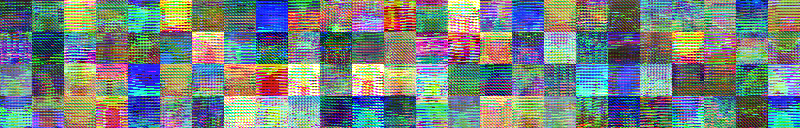


```python
fixed_noise = np.random.normal(size=(batchSize, nz)).astype('float32')
```


```python
train_X = processed_images
train_X.shape
```


    (1732, 32, 32, 3)


```python
import time
import sys
t0 = time.time()
niter = 100
gen_iterations = 0
errG = 0
targetD = np.float32([2]*batchSize+[-2]*batchSize)[:, None]
targetG = np.ones(batchSize, dtype=np.float32)[:, None]
for epoch in range(niter):
    i = 0
    np.random.shuffle(train_X)
    batches = train_X.shape[0]//batchSize
    while i < batches:
        if gen_iterations < 25 or gen_iterations % 20 == 0:
            _Diters = 100
        else:
            _Diters = Diters
        j = 0
        while j < _Diters and i < batches:
            j+=1
            real_data = train_X[i*batchSize:(i+1)*batchSize]
            i+=1
            noise = np.random.normal(size=(batchSize, nz))        
            ϵ = real_data.std() * np.random.uniform(-0.5,0.5, size=real_data.shape) 
            ϵ *= np.random.uniform(size=(batchSize, 1,1,1))
            real_data = real_data.reshape(100,3,32,32)
            ϵ = ϵ.reshape(100,3,32,32)
            errD_real, errD_fake  = netD_train([real_data, noise, ϵ]) 
            errD = errD_real - errD_fake
        if gen_iterations%20==0:
            print('[%d/%d][%d/%d][%d]  Loss_G: %f Use Time: %.2fs'
            % (epoch, niter, i, batches, gen_iterations, errG,time.time()-t0))
            fake = netG.predict(fixed_noise)
            #fake = fake.reshape(10,3,32,32)
            showX(fake,4)
        noise = np.random.normal(size=(batchSize, nz))        
        errG, = netG_train([noise])
        gen_iterations+=1 
```

    [0/100][17/17][0]  Loss_G: 0.000000 Use Time: 9.05s
    


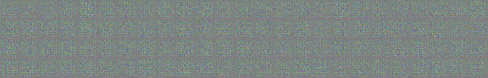


    [20/100][17/17][20]  Loss_G: -4.741011 Use Time: 198.19s
    


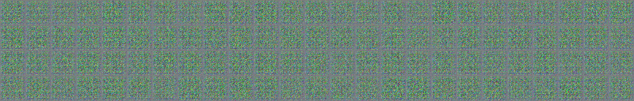


    [28/100][17/17][40]  Loss_G: -1.647445 Use Time: 275.98s
    


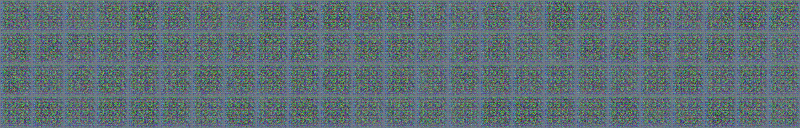


    [33/100][17/17][60]  Loss_G: -0.819408 Use Time: 326.38s
    


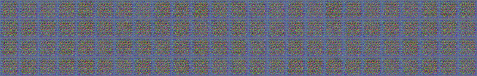


    [38/100][17/17][80]  Loss_G: 2.372312 Use Time: 377.39s
    


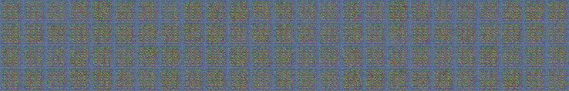


    [43/100][17/17][100]  Loss_G: 1.516008 Use Time: 428.36s
    


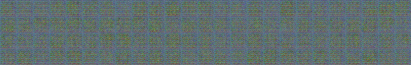


    [48/100][17/17][120]  Loss_G: -1.789770 Use Time: 479.37s
    


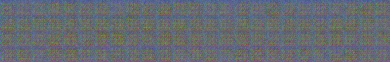


    [53/100][17/17][140]  Loss_G: -2.558804 Use Time: 531.48s
    


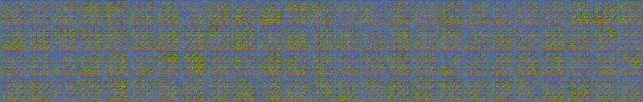


    [58/100][17/17][160]  Loss_G: -3.464355 Use Time: 581.94s
    


    [63/100][17/17][180]  Loss_G: -5.209126 Use Time: 631.09s
    


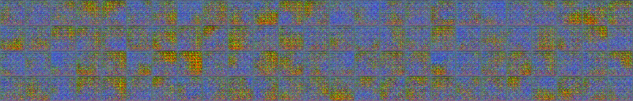


    [68/100][17/17][200]  Loss_G: -3.979020 Use Time: 680.20s
    


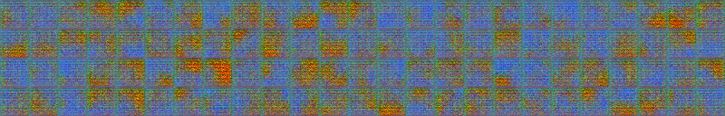


    [73/100][17/17][220]  Loss_G: -2.139106 Use Time: 729.21s
    


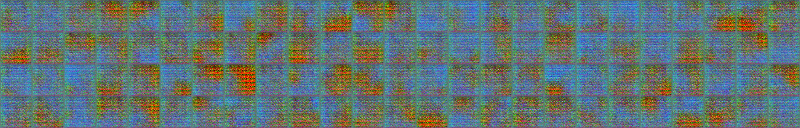


    [78/100][17/17][240]  Loss_G: -2.825271 Use Time: 778.68s
    


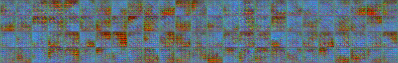


    [83/100][17/17][260]  Loss_G: -2.036079 Use Time: 830.02s
    


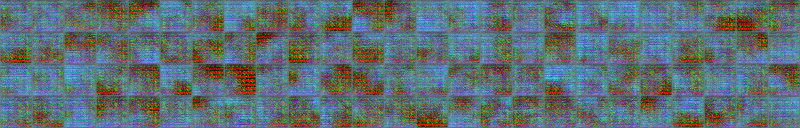


    [88/100][17/17][280]  Loss_G: -6.901738 Use Time: 881.23s
    


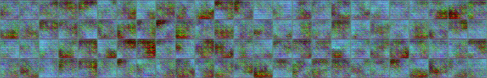


    [93/100][17/17][300]  Loss_G: -8.900268 Use Time: 932.00s
    


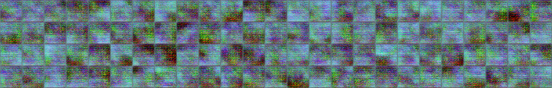


    [98/100][17/17][320]  Loss_G: -9.807257 Use Time: 983.27s
    


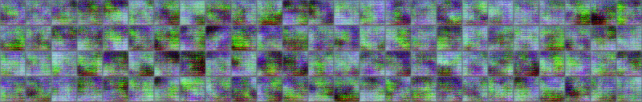

