```python
#导如需要的包
import numpy as np
import os
from glob import glob
import cv2

from keras.layers import Input, Dense, Reshape, Flatten, Dropout
from keras.layers import BatchNormalization, Activation, ZeroPadding2D, UpSampling2D, Conv2D
from keras.layers.advanced_activations import LeakyReLU
from keras.models import Sequential, Model
from keras.optimizers import Adam

%matplotlib inline
import matplotlib.pyplot as plt
```

    Using TensorFlow backend.
    C:\machine_study\Python\Anaconda3\lib\site-packages\h5py\__init__.py:34: FutureWarning: Conversion of the second argument of issubdtype from `float` to `np.floating` is deprecated. In future, it will be treated as `np.float64 == np.dtype(float).type`.
      from ._conv import register_converters as _register_converters
    


```python
#指定数据坐在的目录
PATH = os.path.abspath(os.path.join('data','players'))
IMGS = glob(os.path.join(PATH, "*.jpg"))

print(len(IMGS)) 
print(IMGS[:10]) 
```

    1732
    ['F:\\Kaggle\\generateSP\\data\\players\\static.weltsport.net-100063.jpg', 'F:\\Kaggle\\generateSP\\data\\players\\static.weltsport.net-100350.jpg', 'F:\\Kaggle\\generateSP\\data\\players\\static.weltsport.net-100360.jpg', 'F:\\Kaggle\\generateSP\\data\\players\\static.weltsport.net-10037.jpg', 'F:\\Kaggle\\generateSP\\data\\players\\static.weltsport.net-10038.jpg', 'F:\\Kaggle\\generateSP\\data\\players\\static.weltsport.net-100459.jpg', 'F:\\Kaggle\\generateSP\\data\\players\\static.weltsport.net-10046.jpg', 'F:\\Kaggle\\generateSP\\data\\players\\static.weltsport.net-100557.jpg', 'F:\\Kaggle\\generateSP\\data\\players\\static.weltsport.net-10056.jpg', 'F:\\Kaggle\\generateSP\\data\\players\\static.weltsport.net-10060.jpg']
    


```python
WIDTH = 56
HEIGHT = 70
DEPTH = 3
```


```python
def procImages(images):
    processed_images = []
    
    # 设置深度
    depth = None
    if DEPTH == 1:
        depth = cv2.IMREAD_GRAYSCALE
    elif DEPTH == 3:
        depth = cv2.IMREAD_COLOR
    else:
        print('DEPTH must be set to 1 or to 3.')
        return None
    
    #重置图片大小
    for img in images:
        base = os.path.basename(img)
        full_size_image = cv2.imread(img, depth)
        processed_images.append(cv2.resize(full_size_image, (WIDTH, HEIGHT), interpolation=cv2.INTER_CUBIC))
    processed_images = np.asarray(processed_images)
    
    # 缩放图片到 [-1, 1]
    processed_images = np.divide(processed_images, 127.5) - 1

    return processed_images
```


```python
processed_images = procImages(IMGS)
processed_images.shape
```


    (1732, 70, 56, 3)


```python
fig, axs = plt.subplots(5, 5)
count = 0
for i in range(5):
    for j in range(5):
        img = processed_images[count, :, :, :] * 127.5 + 127.5
        img = np.asarray(img, dtype=np.uint8)
        if DEPTH == 3:
            img = cv2.cvtColor(img, cv2.COLOR_BGR2RGB)
        axs[i, j].imshow(img)
        axs[i, j].axis('off')
        count += 1
plt.show()
```


```python
# GAN 参数设置
LATENT_DIM = 100
G_LAYERS_DIM = [256, 512, 1024]
D_LAYERS_DIM = [1024, 512, 256]

BATCH_SIZE = 16
EPOCHS = 1000000
LR = 0.00002
BETA_1 = 0.5
```


```python
def buildGenerator(img_shape):

    def addLayer(model, dim):
        model.add(Dense(dim))
        model.add(LeakyReLU(alpha=0.2))
        model.add(BatchNormalization(momentum=0.8))
        
    model = Sequential()
    model.add(Dense(G_LAYERS_DIM[0], input_dim=LATENT_DIM))
    model.add(LeakyReLU(alpha=0.2))
    model.add(BatchNormalization(momentum=0.8))
    
    for layer_dim in G_LAYERS_DIM[1:]:
        addLayer(model, layer_dim)
        
    model.add(Dense(np.prod(img_shape), activation='tanh'))
    model.add(Reshape(img_shape))

    model.summary()

    noise = Input(shape=(LATENT_DIM,))
    img = model(noise)

    return Model(noise, img)
```


```python
def buildDiscriminator(img_shape):

    def addLayer(model, dim):
        model.add(Dense(dim))
        model.add(LeakyReLU(alpha=0.2))

    model = Sequential()
    model.add(Flatten(input_shape=img_shape))
    
    for layer_dim in D_LAYERS_DIM:
        addLayer(model, layer_dim)
        
    model.add(Dense(1, activation='sigmoid'))
    model.summary()

    img = Input(shape=img_shape)
    classification = model(img)

    return Model(img, classification)
```


```python
def buildCombined(g, d):
    # 在组合模型上固定住辨识器训练生成器
    d.trainable = False

    # 生成器g获取z作为输入并且输出伪造图片
    z = Input(shape=(LATENT_DIM,))
    fake_img = g(z)

    # 获取伪造图片的分类
    gan_output = d(fake_img)

    # 将生成器结合成低级辨识器
    model = Model(z, gan_output)
    model.summary()
    
    return model
```


```python
def sampleImages(generator):
    rows, columns = 5, 5
    noise = np.random.normal(0, 1, (rows * columns, LATENT_DIM))
    generated_imgs = generator.predict(noise)

    fig, axs = plt.subplots(rows, columns)
    count = 0
    for i in range(rows):
        for j in range(columns):
            img = generated_imgs[count, :, :, :] * 127.5 + 127.5
            img = np.asarray(img, dtype=np.uint8)
            if DEPTH == 3:
                img = cv2.cvtColor(img, cv2.COLOR_BGR2RGB)
            axs[i, j].imshow(img)
            axs[i, j].axis('off')
            count += 1
    plt.show()
```


```python
#初始化参数
optimizer = Adam(LR, BETA_1)
```


```python
#辨识器
d = buildDiscriminator(processed_images.shape[1:])
d.compile(loss='binary_crossentropy', optimizer=optimizer, metrics=['accuracy'])
```

    WARNING:tensorflow:From C:\machine_study\Python\Anaconda3\lib\site-packages\keras\backend\tensorflow_backend.py:1168: calling reduce_prod (from tensorflow.python.ops.math_ops) with keep_dims is deprecated and will be removed in a future version.
    Instructions for updating:
    keep_dims is deprecated, use keepdims instead
    _________________________________________________________________
    Layer (type)                 Output Shape              Param #   
    =================================================================
    flatten_1 (Flatten)          (None, 11760)             0         
    _________________________________________________________________
    dense_1 (Dense)              (None, 1024)              12043264  
    _________________________________________________________________
    leaky_re_lu_1 (LeakyReLU)    (None, 1024)              0         
    _________________________________________________________________
    dense_2 (Dense)              (None, 512)               524800    
    _________________________________________________________________
    leaky_re_lu_2 (LeakyReLU)    (None, 512)               0         
    _________________________________________________________________
    dense_3 (Dense)              (None, 256)               131328    
    _________________________________________________________________
    leaky_re_lu_3 (LeakyReLU)    (None, 256)               0         
    _________________________________________________________________
    dense_4 (Dense)              (None, 1)                 257       
    =================================================================
    Total params: 12,699,649
    Trainable params: 12,699,649
    Non-trainable params: 0
    _________________________________________________________________
    WARNING:tensorflow:From C:\machine_study\Python\Anaconda3\lib\site-packages\keras\backend\tensorflow_backend.py:1257: calling reduce_mean (from tensorflow.python.ops.math_ops) with keep_dims is deprecated and will be removed in a future version.
    Instructions for updating:
    keep_dims is deprecated, use keepdims instead
    


```python
#build generator
g = buildGenerator(processed_images.shape[1:])
g.compile(loss='binary_crossentropy', optimizer=optimizer)
```

    _________________________________________________________________
    Layer (type)                 Output Shape              Param #   
    =================================================================
    dense_5 (Dense)              (None, 256)               25856     
    _________________________________________________________________
    leaky_re_lu_4 (LeakyReLU)    (None, 256)               0         
    _________________________________________________________________
    batch_normalization_1 (Batch (None, 256)               1024      
    _________________________________________________________________
    dense_6 (Dense)              (None, 512)               131584    
    _________________________________________________________________
    leaky_re_lu_5 (LeakyReLU)    (None, 512)               0         
    _________________________________________________________________
    batch_normalization_2 (Batch (None, 512)               2048      
    _________________________________________________________________
    dense_7 (Dense)              (None, 1024)              525312    
    _________________________________________________________________
    leaky_re_lu_6 (LeakyReLU)    (None, 1024)              0         
    _________________________________________________________________
    batch_normalization_3 (Batch (None, 1024)              4096      
    _________________________________________________________________
    dense_8 (Dense)              (None, 11760)             12054000  
    _________________________________________________________________
    reshape_1 (Reshape)          (None, 70, 56, 3)         0         
    =================================================================
    Total params: 12,743,920
    Trainable params: 12,740,336
    Non-trainable params: 3,584
    _________________________________________________________________
    


```python
#build combined model
c = buildCombined(g, d)
c.compile(loss='binary_crossentropy', optimizer=optimizer)
```

    _________________________________________________________________
    Layer (type)                 Output Shape              Param #   
    =================================================================
    input_3 (InputLayer)         (None, 100)               0         
    _________________________________________________________________
    model_2 (Model)              (None, 70, 56, 3)         12743920  
    _________________________________________________________________
    model_1 (Model)              (None, 1)                 12699649  
    =================================================================
    Total params: 25,443,569
    Trainable params: 12,740,336
    Non-trainable params: 12,703,233
    _________________________________________________________________
    


```python
#训练
SAMPLE_INTERVAL = WARNING_INTERVAL = 100

YDis = np.zeros(2 * BATCH_SIZE)
YDis[:BATCH_SIZE] = .9 #平滑标签

YGen = np.ones(BATCH_SIZE)

for epoch in range(EPOCHS):
    # 获取真实图片的batch
    idx = np.random.randint(0, processed_images.shape[0], BATCH_SIZE)
    real_imgs = processed_images[idx]

    # 生成伪造图片的batch
    noise = np.random.normal(0, 1, (BATCH_SIZE, LATENT_DIM))
    fake_imgs = g.predict(noise)
    
    X = np.concatenate([real_imgs, fake_imgs])
    
    # 训练辨识器
    d.trainable = True
    d_loss = d.train_on_batch(X, YDis)

    # 训练生成器
    d.trainable = False
    noise = np.random.normal(0, 1, (BATCH_SIZE, LATENT_DIM))
    g_loss = c.train_on_batch(noise, YGen)

    # 处理
    if (epoch+1) % WARNING_INTERVAL == 0 or epoch == 0:
        print ("%d [Discriminator Loss: %f, Acc.: %.2f%%] [Generator Loss: %f]" % (epoch, d_loss[0], 100. * d_loss[1], g_loss))

    # 如果在保存的时间间隔就保存图片
    if (epoch+1) % SAMPLE_INTERVAL == 0 or epoch == 0:
        sampleImages(g)
```

    0 [Discriminator Loss: 0.705859, Acc.: 3.12%] [Generator Loss: 0.692604]
    


    99 [Discriminator Loss: 0.346443, Acc.: 50.00%] [Generator Loss: 1.530384]
    


    199 [Discriminator Loss: 0.352362, Acc.: 50.00%] [Generator Loss: 1.836948]
    


    299 [Discriminator Loss: 0.315206, Acc.: 50.00%] [Generator Loss: 1.840543]
    


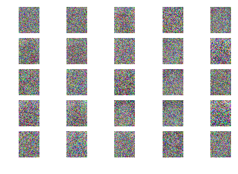


    399 [Discriminator Loss: 0.318767, Acc.: 46.88%] [Generator Loss: 1.605104]
    


    499 [Discriminator Loss: 0.250854, Acc.: 50.00%] [Generator Loss: 1.671041]
    


    599 [Discriminator Loss: 0.381139, Acc.: 50.00%] [Generator Loss: 1.643818]
    


    699 [Discriminator Loss: 0.380562, Acc.: 50.00%] [Generator Loss: 1.474932]
    


    799 [Discriminator Loss: 0.373434, Acc.: 50.00%] [Generator Loss: 1.332633]
    


    899 [Discriminator Loss: 0.616590, Acc.: 46.88%] [Generator Loss: 1.500249]
    


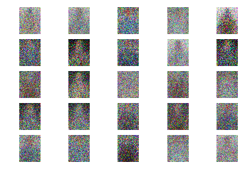


    999 [Discriminator Loss: 0.442836, Acc.: 46.88%] [Generator Loss: 1.480811]
    


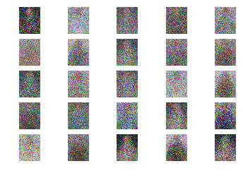


    1099 [Discriminator Loss: 0.409395, Acc.: 46.88%] [Generator Loss: 1.394902]
    


    1199 [Discriminator Loss: 0.508409, Acc.: 43.75%] [Generator Loss: 1.136743]
    


    1299 [Discriminator Loss: 0.477004, Acc.: 43.75%] [Generator Loss: 1.366817]
    


    1399 [Discriminator Loss: 0.594161, Acc.: 43.75%] [Generator Loss: 1.205198]
    


    1499 [Discriminator Loss: 0.518434, Acc.: 50.00%] [Generator Loss: 1.325937]
    


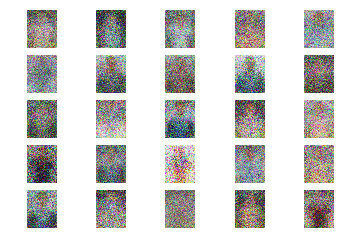


    1599 [Discriminator Loss: 0.577138, Acc.: 43.75%] [Generator Loss: 1.173846]
    


    1699 [Discriminator Loss: 0.390373, Acc.: 50.00%] [Generator Loss: 1.351852]
    


    1799 [Discriminator Loss: 0.508403, Acc.: 46.88%] [Generator Loss: 1.220089]
    


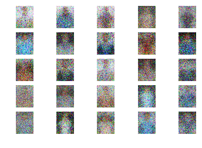


    1899 [Discriminator Loss: 0.544349, Acc.: 31.25%] [Generator Loss: 1.235592]
    


    1999 [Discriminator Loss: 0.502769, Acc.: 40.62%] [Generator Loss: 1.085329]
    


    2099 [Discriminator Loss: 0.424498, Acc.: 50.00%] [Generator Loss: 1.425563]
    


    2199 [Discriminator Loss: 0.478953, Acc.: 46.88%] [Generator Loss: 1.322319]
    


    2299 [Discriminator Loss: 0.548676, Acc.: 50.00%] [Generator Loss: 1.247996]
    


    2399 [Discriminator Loss: 0.465484, Acc.: 50.00%] [Generator Loss: 1.179985]
    


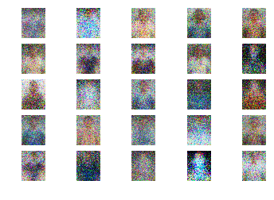


    2499 [Discriminator Loss: 0.511575, Acc.: 43.75%] [Generator Loss: 1.327321]
    


    2599 [Discriminator Loss: 0.496934, Acc.: 46.88%] [Generator Loss: 1.253046]
    


    2699 [Discriminator Loss: 0.493188, Acc.: 50.00%] [Generator Loss: 1.228992]
    


    2799 [Discriminator Loss: 0.526911, Acc.: 50.00%] [Generator Loss: 1.337324]
    


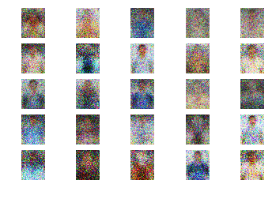


    2899 [Discriminator Loss: 0.472280, Acc.: 43.75%] [Generator Loss: 1.393159]
    


    2999 [Discriminator Loss: 0.454937, Acc.: 46.88%] [Generator Loss: 1.596093]
    


    3099 [Discriminator Loss: 0.437465, Acc.: 46.88%] [Generator Loss: 1.405620]
    


    3199 [Discriminator Loss: 0.508552, Acc.: 46.88%] [Generator Loss: 1.576813]
    


    3299 [Discriminator Loss: 0.459408, Acc.: 50.00%] [Generator Loss: 1.706057]
    


    3399 [Discriminator Loss: 0.456859, Acc.: 43.75%] [Generator Loss: 1.539244]
    


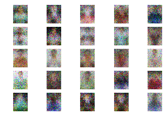


    3499 [Discriminator Loss: 0.466177, Acc.: 50.00%] [Generator Loss: 1.769906]
    


    3599 [Discriminator Loss: 0.407241, Acc.: 46.88%] [Generator Loss: 1.562782]
    


    3699 [Discriminator Loss: 0.394534, Acc.: 43.75%] [Generator Loss: 1.541241]
    


    3799 [Discriminator Loss: 0.420774, Acc.: 50.00%] [Generator Loss: 1.539220]
    


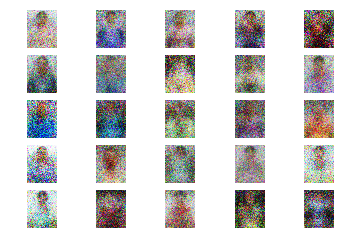


    3899 [Discriminator Loss: 0.465622, Acc.: 40.62%] [Generator Loss: 1.644189]
    


    3999 [Discriminator Loss: 0.470670, Acc.: 46.88%] [Generator Loss: 1.519588]
    


    4099 [Discriminator Loss: 0.446857, Acc.: 50.00%] [Generator Loss: 1.721885]
    


    4199 [Discriminator Loss: 0.460729, Acc.: 46.88%] [Generator Loss: 1.488871]
    


    4299 [Discriminator Loss: 0.506176, Acc.: 43.75%] [Generator Loss: 1.689211]
    


    4399 [Discriminator Loss: 0.499657, Acc.: 46.88%] [Generator Loss: 1.580099]
    


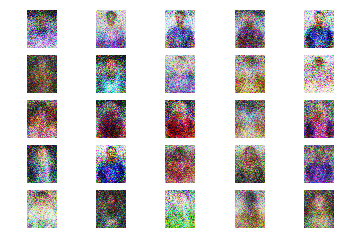


    4499 [Discriminator Loss: 0.423555, Acc.: 46.88%] [Generator Loss: 1.781655]
    


    4599 [Discriminator Loss: 0.502621, Acc.: 37.50%] [Generator Loss: 1.476544]
    


    4699 [Discriminator Loss: 0.447420, Acc.: 40.62%] [Generator Loss: 1.756811]
    


    4799 [Discriminator Loss: 0.395526, Acc.: 46.88%] [Generator Loss: 1.917628]
    


    4899 [Discriminator Loss: 0.357341, Acc.: 50.00%] [Generator Loss: 1.990626]
    


    4999 [Discriminator Loss: 0.348543, Acc.: 50.00%] [Generator Loss: 1.961836]
    


    5099 [Discriminator Loss: 0.405086, Acc.: 50.00%] [Generator Loss: 1.842877]
    


    5199 [Discriminator Loss: 0.379390, Acc.: 50.00%] [Generator Loss: 2.004472]
    


    5299 [Discriminator Loss: 0.374923, Acc.: 46.88%] [Generator Loss: 1.947821]
    


    5399 [Discriminator Loss: 0.357242, Acc.: 50.00%] [Generator Loss: 2.394717]
    


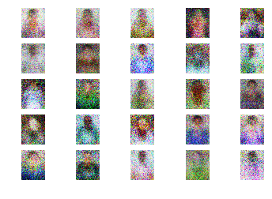


    5499 [Discriminator Loss: 0.391782, Acc.: 46.88%] [Generator Loss: 1.739019]
    


    5599 [Discriminator Loss: 0.348416, Acc.: 46.88%] [Generator Loss: 2.232237]
    


    5699 [Discriminator Loss: 0.336837, Acc.: 50.00%] [Generator Loss: 2.251399]
    


    5799 [Discriminator Loss: 0.361706, Acc.: 46.88%] [Generator Loss: 1.919540]
    


    5899 [Discriminator Loss: 0.394711, Acc.: 46.88%] [Generator Loss: 2.037126]
    


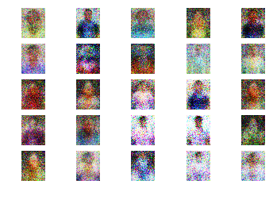


    5999 [Discriminator Loss: 0.340278, Acc.: 50.00%] [Generator Loss: 2.079579]
    


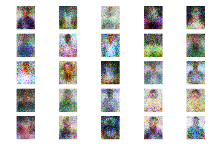


    6099 [Discriminator Loss: 0.408765, Acc.: 40.62%] [Generator Loss: 2.261632]
    


    6199 [Discriminator Loss: 0.323921, Acc.: 50.00%] [Generator Loss: 2.267210]
    


    6299 [Discriminator Loss: 0.459773, Acc.: 46.88%] [Generator Loss: 2.115924]
    


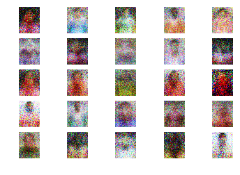


    6399 [Discriminator Loss: 0.403525, Acc.: 46.88%] [Generator Loss: 1.954991]
    


    6499 [Discriminator Loss: 0.390487, Acc.: 43.75%] [Generator Loss: 1.800906]
    


    6599 [Discriminator Loss: 0.365731, Acc.: 46.88%] [Generator Loss: 2.096528]
    


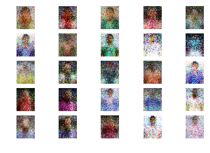


    6699 [Discriminator Loss: 0.318757, Acc.: 50.00%] [Generator Loss: 2.429365]
    


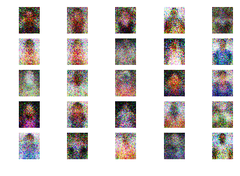


    6799 [Discriminator Loss: 0.452205, Acc.: 43.75%] [Generator Loss: 1.970767]
    


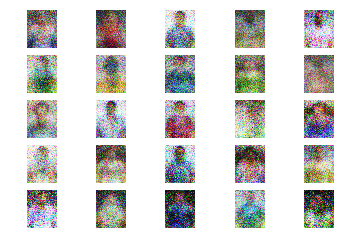


    6899 [Discriminator Loss: 0.298152, Acc.: 50.00%] [Generator Loss: 2.470682]
    


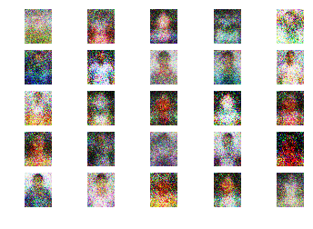


    6999 [Discriminator Loss: 0.347450, Acc.: 46.88%] [Generator Loss: 2.313902]
    


    7099 [Discriminator Loss: 0.355673, Acc.: 43.75%] [Generator Loss: 2.624203]
    


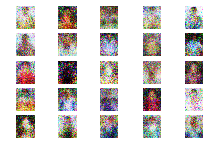


    7199 [Discriminator Loss: 0.330432, Acc.: 50.00%] [Generator Loss: 2.426723]
    


    7299 [Discriminator Loss: 0.331085, Acc.: 50.00%] [Generator Loss: 2.693770]
    


    7399 [Discriminator Loss: 0.332225, Acc.: 50.00%] [Generator Loss: 2.154036]
    


    7499 [Discriminator Loss: 0.317625, Acc.: 50.00%] [Generator Loss: 2.090562]
    


    7599 [Discriminator Loss: 0.333228, Acc.: 46.88%] [Generator Loss: 2.705907]
    


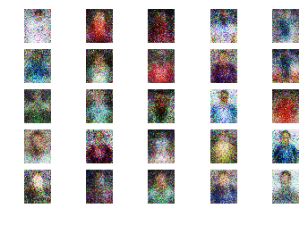


    7699 [Discriminator Loss: 0.259615, Acc.: 50.00%] [Generator Loss: 2.945856]
    


    7799 [Discriminator Loss: 0.294878, Acc.: 50.00%] [Generator Loss: 2.705618]
    


    7899 [Discriminator Loss: 0.290198, Acc.: 50.00%] [Generator Loss: 2.631955]
    


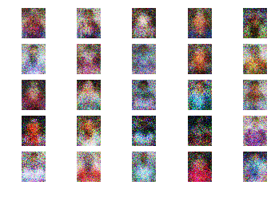


    7999 [Discriminator Loss: 0.266732, Acc.: 50.00%] [Generator Loss: 2.431810]
    


    8099 [Discriminator Loss: 0.283047, Acc.: 50.00%] [Generator Loss: 2.866724]
    


    8199 [Discriminator Loss: 0.313942, Acc.: 50.00%] [Generator Loss: 2.723072]
    


    8299 [Discriminator Loss: 0.270323, Acc.: 50.00%] [Generator Loss: 2.692429]
    


    8399 [Discriminator Loss: 0.263925, Acc.: 46.88%] [Generator Loss: 2.516573]
    


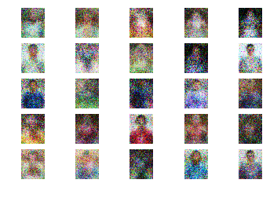


    8499 [Discriminator Loss: 0.352258, Acc.: 50.00%] [Generator Loss: 2.288093]
    


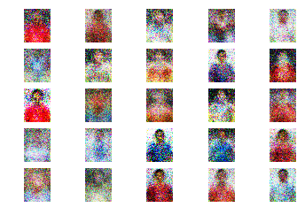


    8599 [Discriminator Loss: 0.298732, Acc.: 50.00%] [Generator Loss: 2.446842]
    


    8699 [Discriminator Loss: 0.248418, Acc.: 50.00%] [Generator Loss: 2.683459]
    


    8799 [Discriminator Loss: 0.261186, Acc.: 50.00%] [Generator Loss: 2.766473]
    


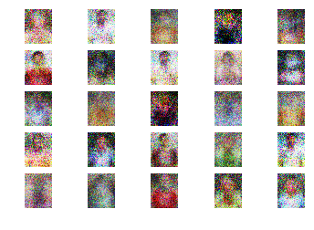


    8899 [Discriminator Loss: 0.303016, Acc.: 50.00%] [Generator Loss: 2.563261]
    


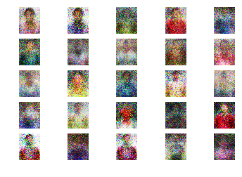


    8999 [Discriminator Loss: 0.311673, Acc.: 40.62%] [Generator Loss: 2.297503]
    


    9099 [Discriminator Loss: 0.251022, Acc.: 50.00%] [Generator Loss: 3.173155]
    


    9199 [Discriminator Loss: 0.263408, Acc.: 50.00%] [Generator Loss: 2.993392]
    


    9299 [Discriminator Loss: 0.286770, Acc.: 50.00%] [Generator Loss: 2.506930]
    


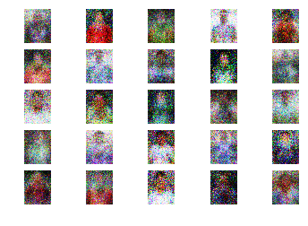


    9399 [Discriminator Loss: 0.266916, Acc.: 50.00%] [Generator Loss: 3.013502]
    


    9499 [Discriminator Loss: 0.334784, Acc.: 46.88%] [Generator Loss: 2.794177]
    


    9599 [Discriminator Loss: 0.262811, Acc.: 50.00%] [Generator Loss: 2.944830]
    


    9699 [Discriminator Loss: 0.240544, Acc.: 50.00%] [Generator Loss: 2.984646]
    


    9799 [Discriminator Loss: 0.329556, Acc.: 43.75%] [Generator Loss: 2.870439]
    


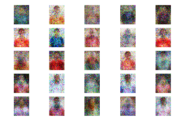


    9899 [Discriminator Loss: 0.274558, Acc.: 50.00%] [Generator Loss: 3.165918]
    


    9999 [Discriminator Loss: 0.230991, Acc.: 50.00%] [Generator Loss: 3.209969]
    


    10099 [Discriminator Loss: 0.270814, Acc.: 50.00%] [Generator Loss: 3.397029]
    


    10199 [Discriminator Loss: 0.247415, Acc.: 50.00%] [Generator Loss: 3.015153]
    


    10299 [Discriminator Loss: 0.221817, Acc.: 50.00%] [Generator Loss: 3.049962]
    


    10399 [Discriminator Loss: 0.267535, Acc.: 50.00%] [Generator Loss: 2.907621]
    


    10499 [Discriminator Loss: 0.254819, Acc.: 50.00%] [Generator Loss: 2.558258]
    


    10599 [Discriminator Loss: 0.246867, Acc.: 50.00%] [Generator Loss: 2.674755]
    


    10699 [Discriminator Loss: 0.254310, Acc.: 50.00%] [Generator Loss: 3.038120]
    


    10799 [Discriminator Loss: 0.249738, Acc.: 50.00%] [Generator Loss: 2.982536]
    


    10899 [Discriminator Loss: 0.231630, Acc.: 50.00%] [Generator Loss: 3.180937]
    


    10999 [Discriminator Loss: 0.238097, Acc.: 50.00%] [Generator Loss: 3.132089]
    


    11099 [Discriminator Loss: 0.247758, Acc.: 50.00%] [Generator Loss: 2.938409]
    


    11199 [Discriminator Loss: 0.256509, Acc.: 50.00%] [Generator Loss: 2.697111]
    


    11299 [Discriminator Loss: 0.214529, Acc.: 50.00%] [Generator Loss: 3.037398]
    


    11399 [Discriminator Loss: 0.236586, Acc.: 50.00%] [Generator Loss: 3.434495]
    


    11499 [Discriminator Loss: 0.249950, Acc.: 50.00%] [Generator Loss: 3.388303]
    


    11599 [Discriminator Loss: 0.221032, Acc.: 50.00%] [Generator Loss: 3.645879]
    


    11699 [Discriminator Loss: 0.253908, Acc.: 50.00%] [Generator Loss: 3.578416]
    


    11799 [Discriminator Loss: 0.215749, Acc.: 50.00%] [Generator Loss: 3.640763]
    


    11899 [Discriminator Loss: 0.224788, Acc.: 50.00%] [Generator Loss: 3.184854]
    


    11999 [Discriminator Loss: 0.221552, Acc.: 50.00%] [Generator Loss: 3.508756]
    


    12099 [Discriminator Loss: 0.273993, Acc.: 50.00%] [Generator Loss: 3.882975]
    


    12199 [Discriminator Loss: 0.240120, Acc.: 50.00%] [Generator Loss: 3.451721]
    


    12299 [Discriminator Loss: 0.219847, Acc.: 50.00%] [Generator Loss: 3.260644]
    


    12399 [Discriminator Loss: 0.245278, Acc.: 50.00%] [Generator Loss: 3.268765]
    


    12499 [Discriminator Loss: 0.275118, Acc.: 50.00%] [Generator Loss: 3.208629]
    


    12599 [Discriminator Loss: 0.208387, Acc.: 50.00%] [Generator Loss: 3.915851]
    


    12699 [Discriminator Loss: 0.195424, Acc.: 50.00%] [Generator Loss: 3.894679]
    


    12799 [Discriminator Loss: 0.216761, Acc.: 50.00%] [Generator Loss: 4.101087]
    


    12899 [Discriminator Loss: 0.233190, Acc.: 50.00%] [Generator Loss: 3.640838]
    


    12999 [Discriminator Loss: 0.207794, Acc.: 50.00%] [Generator Loss: 3.577243]
    


    13099 [Discriminator Loss: 0.238862, Acc.: 50.00%] [Generator Loss: 3.439309]
    


    13199 [Discriminator Loss: 0.268647, Acc.: 50.00%] [Generator Loss: 3.356547]
    


    13299 [Discriminator Loss: 0.213892, Acc.: 50.00%] [Generator Loss: 3.303556]
    


    13399 [Discriminator Loss: 0.197844, Acc.: 50.00%] [Generator Loss: 3.490476]
    


    13499 [Discriminator Loss: 0.220977, Acc.: 50.00%] [Generator Loss: 3.572332]
    


    13599 [Discriminator Loss: 0.236116, Acc.: 50.00%] [Generator Loss: 4.160029]
    


    13699 [Discriminator Loss: 0.216008, Acc.: 50.00%] [Generator Loss: 3.377432]
    


    13799 [Discriminator Loss: 0.222323, Acc.: 50.00%] [Generator Loss: 3.500231]
    


    13899 [Discriminator Loss: 0.216304, Acc.: 50.00%] [Generator Loss: 3.506346]
    


    13999 [Discriminator Loss: 0.218669, Acc.: 50.00%] [Generator Loss: 2.950146]
    


    14099 [Discriminator Loss: 0.224351, Acc.: 50.00%] [Generator Loss: 3.751628]
    


    14199 [Discriminator Loss: 0.224167, Acc.: 50.00%] [Generator Loss: 4.332609]
    


    14299 [Discriminator Loss: 0.264282, Acc.: 50.00%] [Generator Loss: 2.857003]
    


    14399 [Discriminator Loss: 0.241750, Acc.: 50.00%] [Generator Loss: 3.553103]
    


    14499 [Discriminator Loss: 0.210200, Acc.: 50.00%] [Generator Loss: 3.780151]
    


    14599 [Discriminator Loss: 0.209401, Acc.: 50.00%] [Generator Loss: 3.820736]
    


    14699 [Discriminator Loss: 0.231932, Acc.: 50.00%] [Generator Loss: 3.340911]
    


    14799 [Discriminator Loss: 0.206411, Acc.: 50.00%] [Generator Loss: 3.863117]
    


    14899 [Discriminator Loss: 0.209673, Acc.: 50.00%] [Generator Loss: 3.901859]
    


    14999 [Discriminator Loss: 0.244808, Acc.: 50.00%] [Generator Loss: 3.133154]
    


    15099 [Discriminator Loss: 0.231370, Acc.: 50.00%] [Generator Loss: 3.288863]
    


    15199 [Discriminator Loss: 0.199042, Acc.: 50.00%] [Generator Loss: 3.826611]
    


    15299 [Discriminator Loss: 0.226835, Acc.: 50.00%] [Generator Loss: 4.070142]
    


    15399 [Discriminator Loss: 0.226069, Acc.: 50.00%] [Generator Loss: 2.911292]
    


    15499 [Discriminator Loss: 0.214761, Acc.: 50.00%] [Generator Loss: 4.187685]
    


    15599 [Discriminator Loss: 0.202474, Acc.: 50.00%] [Generator Loss: 3.508649]
    


    15699 [Discriminator Loss: 0.228289, Acc.: 50.00%] [Generator Loss: 3.569915]
    


    15799 [Discriminator Loss: 0.216797, Acc.: 50.00%] [Generator Loss: 3.572399]
    


    15899 [Discriminator Loss: 0.198746, Acc.: 50.00%] [Generator Loss: 4.286937]
    


    15999 [Discriminator Loss: 0.242967, Acc.: 50.00%] [Generator Loss: 3.612521]
    


    16099 [Discriminator Loss: 0.206245, Acc.: 50.00%] [Generator Loss: 3.902646]
    


    16199 [Discriminator Loss: 0.180580, Acc.: 50.00%] [Generator Loss: 4.548311]
    


    16299 [Discriminator Loss: 0.235338, Acc.: 50.00%] [Generator Loss: 3.413727]
    


    16399 [Discriminator Loss: 0.292041, Acc.: 50.00%] [Generator Loss: 2.866558]
    


    16499 [Discriminator Loss: 0.220754, Acc.: 50.00%] [Generator Loss: 4.401505]
    


    16599 [Discriminator Loss: 0.231438, Acc.: 50.00%] [Generator Loss: 3.863136]
    


    16699 [Discriminator Loss: 0.187335, Acc.: 50.00%] [Generator Loss: 4.329034]
    


    16799 [Discriminator Loss: 0.201010, Acc.: 50.00%] [Generator Loss: 3.346109]
    


    16899 [Discriminator Loss: 0.215801, Acc.: 50.00%] [Generator Loss: 3.488194]
    


    16999 [Discriminator Loss: 0.206622, Acc.: 50.00%] [Generator Loss: 3.867380]
    


    17099 [Discriminator Loss: 0.270315, Acc.: 46.88%] [Generator Loss: 3.463565]
    


    17199 [Discriminator Loss: 0.286918, Acc.: 50.00%] [Generator Loss: 3.118623]
    


    17299 [Discriminator Loss: 0.211575, Acc.: 50.00%] [Generator Loss: 3.692233]
    


    17399 [Discriminator Loss: 0.194165, Acc.: 50.00%] [Generator Loss: 4.144120]
    


    17499 [Discriminator Loss: 0.203366, Acc.: 50.00%] [Generator Loss: 4.427969]
    


    17599 [Discriminator Loss: 0.199592, Acc.: 50.00%] [Generator Loss: 3.723123]
    


    17699 [Discriminator Loss: 0.185506, Acc.: 50.00%] [Generator Loss: 4.647007]
    


    17799 [Discriminator Loss: 0.206298, Acc.: 50.00%] [Generator Loss: 4.435544]
    


    17899 [Discriminator Loss: 0.185807, Acc.: 50.00%] [Generator Loss: 4.616975]
    


    17999 [Discriminator Loss: 0.226260, Acc.: 50.00%] [Generator Loss: 3.611944]
    


    18099 [Discriminator Loss: 0.192843, Acc.: 50.00%] [Generator Loss: 4.490035]
    


    18199 [Discriminator Loss: 0.207687, Acc.: 50.00%] [Generator Loss: 4.160069]
    


    18299 [Discriminator Loss: 0.192843, Acc.: 50.00%] [Generator Loss: 4.267022]
    


    18399 [Discriminator Loss: 0.204442, Acc.: 50.00%] [Generator Loss: 3.245438]
    


    18499 [Discriminator Loss: 0.245554, Acc.: 50.00%] [Generator Loss: 4.157769]
    


    18599 [Discriminator Loss: 0.198838, Acc.: 50.00%] [Generator Loss: 3.599926]
    


    18699 [Discriminator Loss: 0.197155, Acc.: 50.00%] [Generator Loss: 4.485633]
    


    18799 [Discriminator Loss: 0.222223, Acc.: 50.00%] [Generator Loss: 4.615891]
    


    18899 [Discriminator Loss: 0.199631, Acc.: 50.00%] [Generator Loss: 3.855389]
    


    18999 [Discriminator Loss: 0.199488, Acc.: 50.00%] [Generator Loss: 4.179087]
    


    19099 [Discriminator Loss: 0.196709, Acc.: 50.00%] [Generator Loss: 5.134875]
    


    19199 [Discriminator Loss: 0.213260, Acc.: 50.00%] [Generator Loss: 4.183051]
    


    19299 [Discriminator Loss: 0.275807, Acc.: 50.00%] [Generator Loss: 4.370052]
    


    19399 [Discriminator Loss: 0.190310, Acc.: 50.00%] [Generator Loss: 4.434796]
    


    19499 [Discriminator Loss: 0.203334, Acc.: 50.00%] [Generator Loss: 3.944854]
    


    19599 [Discriminator Loss: 0.218442, Acc.: 50.00%] [Generator Loss: 4.823578]
    


    19699 [Discriminator Loss: 0.256380, Acc.: 50.00%] [Generator Loss: 4.390144]
    


    19799 [Discriminator Loss: 0.177840, Acc.: 50.00%] [Generator Loss: 4.659359]
    


    19899 [Discriminator Loss: 0.184137, Acc.: 50.00%] [Generator Loss: 4.996747]
    


    19999 [Discriminator Loss: 0.202941, Acc.: 50.00%] [Generator Loss: 4.638603]
    


    20099 [Discriminator Loss: 0.189119, Acc.: 50.00%] [Generator Loss: 4.726477]
    


    20199 [Discriminator Loss: 0.211787, Acc.: 50.00%] [Generator Loss: 4.203971]
    


    20299 [Discriminator Loss: 0.225055, Acc.: 46.88%] [Generator Loss: 4.764792]
    


    20399 [Discriminator Loss: 0.220626, Acc.: 50.00%] [Generator Loss: 3.849586]
    


    20499 [Discriminator Loss: 0.201288, Acc.: 50.00%] [Generator Loss: 4.659321]
    


    20599 [Discriminator Loss: 0.198873, Acc.: 50.00%] [Generator Loss: 4.843485]
    


    20699 [Discriminator Loss: 0.233455, Acc.: 50.00%] [Generator Loss: 3.674802]
    


    20799 [Discriminator Loss: 0.177701, Acc.: 50.00%] [Generator Loss: 5.522161]
    


    20899 [Discriminator Loss: 0.193361, Acc.: 50.00%] [Generator Loss: 4.830045]
    


    20999 [Discriminator Loss: 0.203715, Acc.: 50.00%] [Generator Loss: 4.772823]
    


    21099 [Discriminator Loss: 0.191167, Acc.: 50.00%] [Generator Loss: 5.752180]
    


    21199 [Discriminator Loss: 0.197812, Acc.: 50.00%] [Generator Loss: 4.150517]
    


    21299 [Discriminator Loss: 0.188951, Acc.: 50.00%] [Generator Loss: 4.375514]
    


    21399 [Discriminator Loss: 0.246873, Acc.: 46.88%] [Generator Loss: 5.401443]
    


    21499 [Discriminator Loss: 0.213696, Acc.: 50.00%] [Generator Loss: 4.633869]
    


    21599 [Discriminator Loss: 0.201305, Acc.: 50.00%] [Generator Loss: 4.289634]
    


    21699 [Discriminator Loss: 0.215610, Acc.: 50.00%] [Generator Loss: 4.645699]
    


    21799 [Discriminator Loss: 0.190359, Acc.: 50.00%] [Generator Loss: 4.535028]
    


    21899 [Discriminator Loss: 0.232339, Acc.: 50.00%] [Generator Loss: 4.778258]
    


    21999 [Discriminator Loss: 0.185421, Acc.: 50.00%] [Generator Loss: 5.345923]
    


    22099 [Discriminator Loss: 0.191622, Acc.: 50.00%] [Generator Loss: 5.098998]
    


    22199 [Discriminator Loss: 0.201439, Acc.: 50.00%] [Generator Loss: 4.778505]
    


    22299 [Discriminator Loss: 0.181242, Acc.: 50.00%] [Generator Loss: 4.593478]
    


    22399 [Discriminator Loss: 0.209659, Acc.: 50.00%] [Generator Loss: 4.705475]
    


    22499 [Discriminator Loss: 0.198298, Acc.: 50.00%] [Generator Loss: 5.131633]
    


    22599 [Discriminator Loss: 0.200207, Acc.: 50.00%] [Generator Loss: 4.750843]
    


    22699 [Discriminator Loss: 0.213704, Acc.: 50.00%] [Generator Loss: 4.453341]
    


    22799 [Discriminator Loss: 0.232338, Acc.: 50.00%] [Generator Loss: 4.298847]
    


    22899 [Discriminator Loss: 0.198115, Acc.: 50.00%] [Generator Loss: 4.578321]
    


    22999 [Discriminator Loss: 0.194718, Acc.: 50.00%] [Generator Loss: 4.222215]
    


    23099 [Discriminator Loss: 0.194774, Acc.: 50.00%] [Generator Loss: 5.660826]
    


    23199 [Discriminator Loss: 0.208415, Acc.: 50.00%] [Generator Loss: 5.179228]
    


    23299 [Discriminator Loss: 0.206255, Acc.: 50.00%] [Generator Loss: 5.425950]
    


    23399 [Discriminator Loss: 0.216427, Acc.: 50.00%] [Generator Loss: 4.779734]
    


    23499 [Discriminator Loss: 0.211743, Acc.: 50.00%] [Generator Loss: 4.798205]
    


    23599 [Discriminator Loss: 0.180542, Acc.: 50.00%] [Generator Loss: 5.452457]
    


    23699 [Discriminator Loss: 0.228408, Acc.: 50.00%] [Generator Loss: 4.792343]
    


    23799 [Discriminator Loss: 0.179203, Acc.: 50.00%] [Generator Loss: 4.947266]
    


    23899 [Discriminator Loss: 0.201749, Acc.: 50.00%] [Generator Loss: 4.708875]
    


    23999 [Discriminator Loss: 0.199291, Acc.: 50.00%] [Generator Loss: 5.109673]
    


    24099 [Discriminator Loss: 0.190386, Acc.: 50.00%] [Generator Loss: 5.272611]
    


    24199 [Discriminator Loss: 0.180752, Acc.: 50.00%] [Generator Loss: 4.765657]
    


    24299 [Discriminator Loss: 0.243882, Acc.: 50.00%] [Generator Loss: 6.156512]
    


    24399 [Discriminator Loss: 0.272706, Acc.: 50.00%] [Generator Loss: 4.510758]
    


    24499 [Discriminator Loss: 0.191528, Acc.: 50.00%] [Generator Loss: 3.890719]
    


    24599 [Discriminator Loss: 0.197887, Acc.: 50.00%] [Generator Loss: 4.072302]
    


    24699 [Discriminator Loss: 0.194958, Acc.: 50.00%] [Generator Loss: 4.445964]
    


    24799 [Discriminator Loss: 0.232779, Acc.: 50.00%] [Generator Loss: 5.405078]
    


    24899 [Discriminator Loss: 0.227079, Acc.: 50.00%] [Generator Loss: 4.927087]
    


    24999 [Discriminator Loss: 0.227547, Acc.: 50.00%] [Generator Loss: 5.198724]
    


    25099 [Discriminator Loss: 0.213896, Acc.: 50.00%] [Generator Loss: 5.226925]
    


    25199 [Discriminator Loss: 0.192550, Acc.: 50.00%] [Generator Loss: 4.716604]
    


    25299 [Discriminator Loss: 0.197439, Acc.: 50.00%] [Generator Loss: 5.542611]
    


    25399 [Discriminator Loss: 0.200147, Acc.: 50.00%] [Generator Loss: 4.853840]
    


    25499 [Discriminator Loss: 0.196321, Acc.: 50.00%] [Generator Loss: 4.562839]
    


    25599 [Discriminator Loss: 0.207211, Acc.: 50.00%] [Generator Loss: 4.528983]
    


    25699 [Discriminator Loss: 0.266717, Acc.: 50.00%] [Generator Loss: 3.624197]
    


    25799 [Discriminator Loss: 0.244886, Acc.: 50.00%] [Generator Loss: 4.616258]
    


    25899 [Discriminator Loss: 0.198208, Acc.: 50.00%] [Generator Loss: 4.439633]
    


    25999 [Discriminator Loss: 0.245468, Acc.: 50.00%] [Generator Loss: 4.658411]
    


    26099 [Discriminator Loss: 0.196523, Acc.: 50.00%] [Generator Loss: 4.459651]
    


    26199 [Discriminator Loss: 0.212240, Acc.: 46.88%] [Generator Loss: 4.864231]
    


    26299 [Discriminator Loss: 0.218585, Acc.: 50.00%] [Generator Loss: 5.239383]
    


    26399 [Discriminator Loss: 0.245140, Acc.: 50.00%] [Generator Loss: 4.893253]
    


    26499 [Discriminator Loss: 0.227162, Acc.: 50.00%] [Generator Loss: 4.716321]
    


    26599 [Discriminator Loss: 0.288852, Acc.: 50.00%] [Generator Loss: 3.378398]
    


    26699 [Discriminator Loss: 0.227221, Acc.: 50.00%] [Generator Loss: 4.703102]
    


    26799 [Discriminator Loss: 0.206523, Acc.: 50.00%] [Generator Loss: 3.986953]
    


    26899 [Discriminator Loss: 0.253822, Acc.: 50.00%] [Generator Loss: 4.563589]
    


    26999 [Discriminator Loss: 0.174230, Acc.: 50.00%] [Generator Loss: 6.440557]
    


    27099 [Discriminator Loss: 0.246005, Acc.: 50.00%] [Generator Loss: 4.068841]
    


    27199 [Discriminator Loss: 0.201281, Acc.: 50.00%] [Generator Loss: 4.284819]
    


    27299 [Discriminator Loss: 0.428430, Acc.: 50.00%] [Generator Loss: 3.714534]
    


    27399 [Discriminator Loss: 0.303394, Acc.: 50.00%] [Generator Loss: 3.937818]
    


    27499 [Discriminator Loss: 0.203092, Acc.: 50.00%] [Generator Loss: 4.367931]
    


    27599 [Discriminator Loss: 0.249478, Acc.: 50.00%] [Generator Loss: 3.030441]
    


    27699 [Discriminator Loss: 0.211508, Acc.: 50.00%] [Generator Loss: 3.936856]
    


    27799 [Discriminator Loss: 0.225003, Acc.: 50.00%] [Generator Loss: 3.744143]
    


    27899 [Discriminator Loss: 0.205079, Acc.: 50.00%] [Generator Loss: 4.494799]
    


    27999 [Discriminator Loss: 0.201561, Acc.: 50.00%] [Generator Loss: 4.659624]
    


    28099 [Discriminator Loss: 0.224247, Acc.: 50.00%] [Generator Loss: 3.417658]
    


    28199 [Discriminator Loss: 0.187141, Acc.: 50.00%] [Generator Loss: 5.016285]
    


    28299 [Discriminator Loss: 0.233293, Acc.: 50.00%] [Generator Loss: 3.602603]
    


    28399 [Discriminator Loss: 0.195834, Acc.: 50.00%] [Generator Loss: 4.704080]
    


    28499 [Discriminator Loss: 0.190982, Acc.: 50.00%] [Generator Loss: 4.694103]
    


    28599 [Discriminator Loss: 0.205614, Acc.: 50.00%] [Generator Loss: 4.792244]
    


    28699 [Discriminator Loss: 0.189974, Acc.: 50.00%] [Generator Loss: 4.458751]
    


    28799 [Discriminator Loss: 0.228381, Acc.: 50.00%] [Generator Loss: 4.094924]
    


    28899 [Discriminator Loss: 0.194014, Acc.: 50.00%] [Generator Loss: 4.165119]
    


    28999 [Discriminator Loss: 0.198695, Acc.: 50.00%] [Generator Loss: 4.423394]
    


    29099 [Discriminator Loss: 0.191437, Acc.: 50.00%] [Generator Loss: 4.928921]
    


    29199 [Discriminator Loss: 0.227450, Acc.: 50.00%] [Generator Loss: 4.077593]
    


    29299 [Discriminator Loss: 0.254490, Acc.: 50.00%] [Generator Loss: 4.073380]
    


    29399 [Discriminator Loss: 0.232988, Acc.: 50.00%] [Generator Loss: 3.254632]
    


    29499 [Discriminator Loss: 0.197651, Acc.: 50.00%] [Generator Loss: 4.944232]
    


    29599 [Discriminator Loss: 0.192195, Acc.: 50.00%] [Generator Loss: 4.564324]
    


    29699 [Discriminator Loss: 0.250641, Acc.: 50.00%] [Generator Loss: 4.026864]
    


    29799 [Discriminator Loss: 0.187160, Acc.: 50.00%] [Generator Loss: 4.863910]
    


    29899 [Discriminator Loss: 0.207581, Acc.: 50.00%] [Generator Loss: 5.083276]
    


    29999 [Discriminator Loss: 0.179740, Acc.: 50.00%] [Generator Loss: 4.817950]
    


    30099 [Discriminator Loss: 0.206254, Acc.: 50.00%] [Generator Loss: 4.544405]
    


    30199 [Discriminator Loss: 0.193486, Acc.: 50.00%] [Generator Loss: 4.692171]
    


    30299 [Discriminator Loss: 0.290577, Acc.: 50.00%] [Generator Loss: 3.415726]
    


    30399 [Discriminator Loss: 0.190372, Acc.: 50.00%] [Generator Loss: 4.674561]
    


    30499 [Discriminator Loss: 0.186977, Acc.: 50.00%] [Generator Loss: 5.228439]
    


    30599 [Discriminator Loss: 0.187123, Acc.: 50.00%] [Generator Loss: 5.297214]
    


    30699 [Discriminator Loss: 0.180491, Acc.: 50.00%] [Generator Loss: 5.399487]
    


    30799 [Discriminator Loss: 0.226262, Acc.: 50.00%] [Generator Loss: 4.262157]
    


    30899 [Discriminator Loss: 0.184731, Acc.: 50.00%] [Generator Loss: 4.959188]
    


    30999 [Discriminator Loss: 0.187379, Acc.: 50.00%] [Generator Loss: 5.014345]
    


    31099 [Discriminator Loss: 0.248171, Acc.: 43.75%] [Generator Loss: 5.245766]
    


    31199 [Discriminator Loss: 0.238861, Acc.: 50.00%] [Generator Loss: 4.697570]
    


    31299 [Discriminator Loss: 0.204324, Acc.: 50.00%] [Generator Loss: 5.709866]
    


    31399 [Discriminator Loss: 0.227242, Acc.: 50.00%] [Generator Loss: 5.194775]
    


    31499 [Discriminator Loss: 0.185364, Acc.: 50.00%] [Generator Loss: 6.288341]
    


    31599 [Discriminator Loss: 0.193201, Acc.: 50.00%] [Generator Loss: 5.355061]
    


    31699 [Discriminator Loss: 0.221814, Acc.: 50.00%] [Generator Loss: 4.799547]
    


    31799 [Discriminator Loss: 0.204434, Acc.: 50.00%] [Generator Loss: 5.241780]
    


    31899 [Discriminator Loss: 0.268361, Acc.: 50.00%] [Generator Loss: 3.726466]
    


    31999 [Discriminator Loss: 0.201867, Acc.: 50.00%] [Generator Loss: 5.096879]
    


    32099 [Discriminator Loss: 0.320904, Acc.: 50.00%] [Generator Loss: 4.657047]
    


    32199 [Discriminator Loss: 0.179598, Acc.: 50.00%] [Generator Loss: 5.443740]
    


    32299 [Discriminator Loss: 0.235149, Acc.: 50.00%] [Generator Loss: 4.168787]
    


    32399 [Discriminator Loss: 0.197031, Acc.: 50.00%] [Generator Loss: 4.795702]
    


    32499 [Discriminator Loss: 0.219637, Acc.: 46.88%] [Generator Loss: 4.804122]
    


    32599 [Discriminator Loss: 0.232339, Acc.: 50.00%] [Generator Loss: 5.863583]
    


    32699 [Discriminator Loss: 0.227569, Acc.: 50.00%] [Generator Loss: 5.173666]
    


    32799 [Discriminator Loss: 0.209477, Acc.: 50.00%] [Generator Loss: 4.414763]
    


    32899 [Discriminator Loss: 0.223731, Acc.: 50.00%] [Generator Loss: 4.672632]
    


    32999 [Discriminator Loss: 0.212680, Acc.: 50.00%] [Generator Loss: 4.817073]
    


    33099 [Discriminator Loss: 0.211989, Acc.: 50.00%] [Generator Loss: 4.165356]
    


    33199 [Discriminator Loss: 0.203803, Acc.: 50.00%] [Generator Loss: 5.158484]
    


    33299 [Discriminator Loss: 0.219528, Acc.: 46.88%] [Generator Loss: 5.252950]
    


    33399 [Discriminator Loss: 0.217414, Acc.: 50.00%] [Generator Loss: 4.507004]
    


    33499 [Discriminator Loss: 0.191622, Acc.: 50.00%] [Generator Loss: 4.523240]
    


    33599 [Discriminator Loss: 0.237810, Acc.: 50.00%] [Generator Loss: 3.667682]
    


    33699 [Discriminator Loss: 0.229195, Acc.: 50.00%] [Generator Loss: 3.791856]
    


    33799 [Discriminator Loss: 0.235371, Acc.: 50.00%] [Generator Loss: 3.938595]
    


    33899 [Discriminator Loss: 0.203519, Acc.: 50.00%] [Generator Loss: 3.787020]
    


    33999 [Discriminator Loss: 0.192925, Acc.: 50.00%] [Generator Loss: 5.803423]
    


    34099 [Discriminator Loss: 0.199673, Acc.: 50.00%] [Generator Loss: 4.949805]
    


    34199 [Discriminator Loss: 0.185881, Acc.: 50.00%] [Generator Loss: 5.055093]
    


    34299 [Discriminator Loss: 0.194823, Acc.: 50.00%] [Generator Loss: 5.012200]
    


    34399 [Discriminator Loss: 0.221535, Acc.: 50.00%] [Generator Loss: 4.045897]
    


    34499 [Discriminator Loss: 0.258534, Acc.: 50.00%] [Generator Loss: 3.881058]
    


    34599 [Discriminator Loss: 0.219488, Acc.: 50.00%] [Generator Loss: 4.537618]
    


    34699 [Discriminator Loss: 0.208456, Acc.: 50.00%] [Generator Loss: 4.781159]
    


    34799 [Discriminator Loss: 0.196974, Acc.: 50.00%] [Generator Loss: 4.270106]
    


    34899 [Discriminator Loss: 0.200924, Acc.: 50.00%] [Generator Loss: 4.575688]
    


    34999 [Discriminator Loss: 0.209164, Acc.: 46.88%] [Generator Loss: 5.279465]
    


    35099 [Discriminator Loss: 0.192432, Acc.: 50.00%] [Generator Loss: 4.871521]
    


    35199 [Discriminator Loss: 0.189767, Acc.: 50.00%] [Generator Loss: 5.368334]
    


    35299 [Discriminator Loss: 0.190972, Acc.: 50.00%] [Generator Loss: 4.812129]
    


    35399 [Discriminator Loss: 0.200310, Acc.: 50.00%] [Generator Loss: 4.384276]
    


    35499 [Discriminator Loss: 0.217048, Acc.: 50.00%] [Generator Loss: 5.226769]
    


    35599 [Discriminator Loss: 0.208398, Acc.: 50.00%] [Generator Loss: 4.682844]
    


    35699 [Discriminator Loss: 0.196955, Acc.: 50.00%] [Generator Loss: 4.887307]
    


    35799 [Discriminator Loss: 0.197530, Acc.: 50.00%] [Generator Loss: 4.802269]
    


    35899 [Discriminator Loss: 0.206539, Acc.: 50.00%] [Generator Loss: 4.463434]
    


    35999 [Discriminator Loss: 0.208142, Acc.: 50.00%] [Generator Loss: 5.039951]
    


    36099 [Discriminator Loss: 0.207445, Acc.: 50.00%] [Generator Loss: 3.993265]
    


    36199 [Discriminator Loss: 0.203096, Acc.: 50.00%] [Generator Loss: 5.376816]
    


    36299 [Discriminator Loss: 0.223095, Acc.: 50.00%] [Generator Loss: 4.248487]
    


    36399 [Discriminator Loss: 0.211814, Acc.: 50.00%] [Generator Loss: 4.816875]
    


    36499 [Discriminator Loss: 0.263102, Acc.: 50.00%] [Generator Loss: 4.233924]
    


    36599 [Discriminator Loss: 0.216920, Acc.: 50.00%] [Generator Loss: 5.123439]
    


    36699 [Discriminator Loss: 0.203219, Acc.: 50.00%] [Generator Loss: 4.297037]
    


    36799 [Discriminator Loss: 0.181492, Acc.: 50.00%] [Generator Loss: 5.009568]
    


    36899 [Discriminator Loss: 0.208900, Acc.: 50.00%] [Generator Loss: 4.826907]
    


    36999 [Discriminator Loss: 0.207333, Acc.: 50.00%] [Generator Loss: 4.451300]
    


    37099 [Discriminator Loss: 0.187324, Acc.: 50.00%] [Generator Loss: 5.002056]
    


    37199 [Discriminator Loss: 0.216076, Acc.: 50.00%] [Generator Loss: 4.617548]
    


    37299 [Discriminator Loss: 0.195275, Acc.: 50.00%] [Generator Loss: 4.283769]
    


    37399 [Discriminator Loss: 0.269336, Acc.: 50.00%] [Generator Loss: 4.847116]
    


    37499 [Discriminator Loss: 0.238956, Acc.: 46.88%] [Generator Loss: 4.568676]
    


    37599 [Discriminator Loss: 0.213219, Acc.: 50.00%] [Generator Loss: 4.868883]
    


    37699 [Discriminator Loss: 0.229524, Acc.: 50.00%] [Generator Loss: 4.727124]
    


    37799 [Discriminator Loss: 0.231402, Acc.: 50.00%] [Generator Loss: 3.934648]
    


    37899 [Discriminator Loss: 0.201499, Acc.: 50.00%] [Generator Loss: 4.475463]
    


    37999 [Discriminator Loss: 0.206401, Acc.: 50.00%] [Generator Loss: 4.741904]
    


    38099 [Discriminator Loss: 0.248853, Acc.: 50.00%] [Generator Loss: 4.486191]
    


    38199 [Discriminator Loss: 0.226674, Acc.: 50.00%] [Generator Loss: 4.152228]
    


    38299 [Discriminator Loss: 0.186768, Acc.: 50.00%] [Generator Loss: 4.459595]
    


    38399 [Discriminator Loss: 0.217625, Acc.: 50.00%] [Generator Loss: 5.312999]
    


    38499 [Discriminator Loss: 0.244429, Acc.: 50.00%] [Generator Loss: 5.075632]
    


    38599 [Discriminator Loss: 0.188185, Acc.: 50.00%] [Generator Loss: 4.792708]
    


    38699 [Discriminator Loss: 0.182508, Acc.: 50.00%] [Generator Loss: 4.583794]
    


    38799 [Discriminator Loss: 0.180235, Acc.: 50.00%] [Generator Loss: 5.452372]
    


    38899 [Discriminator Loss: 0.201882, Acc.: 50.00%] [Generator Loss: 4.441399]
    


    38999 [Discriminator Loss: 0.190872, Acc.: 50.00%] [Generator Loss: 4.346539]
    


    39099 [Discriminator Loss: 0.197275, Acc.: 50.00%] [Generator Loss: 4.514620]
    


    39199 [Discriminator Loss: 0.203939, Acc.: 50.00%] [Generator Loss: 5.047291]
    


    39299 [Discriminator Loss: 0.174501, Acc.: 50.00%] [Generator Loss: 5.367162]
    


    39399 [Discriminator Loss: 0.216457, Acc.: 50.00%] [Generator Loss: 3.922556]
    


    39499 [Discriminator Loss: 0.237919, Acc.: 50.00%] [Generator Loss: 5.282147]
    


    39599 [Discriminator Loss: 0.187351, Acc.: 50.00%] [Generator Loss: 5.655998]
    


    39699 [Discriminator Loss: 0.187151, Acc.: 50.00%] [Generator Loss: 5.259088]
    


    39799 [Discriminator Loss: 0.196218, Acc.: 50.00%] [Generator Loss: 5.127178]
    


    39899 [Discriminator Loss: 0.222332, Acc.: 50.00%] [Generator Loss: 5.078945]
    


    39999 [Discriminator Loss: 0.201935, Acc.: 50.00%] [Generator Loss: 4.790720]
    


    40099 [Discriminator Loss: 0.198137, Acc.: 50.00%] [Generator Loss: 4.997955]
    


    40199 [Discriminator Loss: 0.247666, Acc.: 50.00%] [Generator Loss: 6.073701]
    


    40299 [Discriminator Loss: 0.222516, Acc.: 50.00%] [Generator Loss: 4.675921]
    


    40399 [Discriminator Loss: 0.200556, Acc.: 50.00%] [Generator Loss: 4.607599]
    


    40499 [Discriminator Loss: 0.192173, Acc.: 50.00%] [Generator Loss: 5.141148]
    


    40599 [Discriminator Loss: 0.204808, Acc.: 50.00%] [Generator Loss: 5.108368]
    


    40699 [Discriminator Loss: 0.222247, Acc.: 50.00%] [Generator Loss: 4.488996]
    


    40799 [Discriminator Loss: 0.187329, Acc.: 50.00%] [Generator Loss: 6.106511]
    


    40899 [Discriminator Loss: 0.185916, Acc.: 50.00%] [Generator Loss: 5.529009]
    


    40999 [Discriminator Loss: 0.183521, Acc.: 50.00%] [Generator Loss: 5.972779]
    


    41099 [Discriminator Loss: 0.199856, Acc.: 50.00%] [Generator Loss: 4.945886]
    


    41199 [Discriminator Loss: 0.382985, Acc.: 50.00%] [Generator Loss: 4.656253]
    


    41299 [Discriminator Loss: 0.198661, Acc.: 50.00%] [Generator Loss: 5.063895]
    


    41399 [Discriminator Loss: 0.194914, Acc.: 50.00%] [Generator Loss: 4.457287]
    


    41499 [Discriminator Loss: 0.236169, Acc.: 50.00%] [Generator Loss: 4.631660]
    


    41599 [Discriminator Loss: 0.269300, Acc.: 46.88%] [Generator Loss: 5.269789]
    


    41699 [Discriminator Loss: 0.185568, Acc.: 50.00%] [Generator Loss: 4.515068]
    


    41799 [Discriminator Loss: 0.197894, Acc.: 50.00%] [Generator Loss: 4.157397]
    


    41899 [Discriminator Loss: 0.195463, Acc.: 50.00%] [Generator Loss: 4.355138]
    


    41999 [Discriminator Loss: 0.193579, Acc.: 50.00%] [Generator Loss: 3.714145]
    


    42099 [Discriminator Loss: 0.295977, Acc.: 46.88%] [Generator Loss: 4.129004]
    


    42199 [Discriminator Loss: 0.264228, Acc.: 50.00%] [Generator Loss: 4.270266]
    


    42299 [Discriminator Loss: 0.201707, Acc.: 50.00%] [Generator Loss: 4.148371]
    


    42399 [Discriminator Loss: 0.206453, Acc.: 50.00%] [Generator Loss: 4.386889]
    


    42499 [Discriminator Loss: 0.195182, Acc.: 50.00%] [Generator Loss: 4.571601]
    


    42599 [Discriminator Loss: 0.214281, Acc.: 50.00%] [Generator Loss: 4.182468]
    


    42699 [Discriminator Loss: 0.199033, Acc.: 50.00%] [Generator Loss: 3.984059]
    


    42799 [Discriminator Loss: 0.178203, Acc.: 50.00%] [Generator Loss: 4.689199]
    


    42899 [Discriminator Loss: 0.209975, Acc.: 50.00%] [Generator Loss: 4.312890]
    


    42999 [Discriminator Loss: 0.230848, Acc.: 50.00%] [Generator Loss: 4.152761]
    


    43099 [Discriminator Loss: 0.248115, Acc.: 50.00%] [Generator Loss: 5.235784]
    


    43199 [Discriminator Loss: 0.189673, Acc.: 50.00%] [Generator Loss: 4.238753]
    


    43299 [Discriminator Loss: 0.227421, Acc.: 50.00%] [Generator Loss: 4.260222]
    


    43399 [Discriminator Loss: 0.270353, Acc.: 46.88%] [Generator Loss: 4.969910]
    


    43499 [Discriminator Loss: 0.197525, Acc.: 50.00%] [Generator Loss: 5.055779]
    


    43599 [Discriminator Loss: 0.219022, Acc.: 50.00%] [Generator Loss: 4.795819]
    


    43699 [Discriminator Loss: 0.267247, Acc.: 46.88%] [Generator Loss: 4.997390]
    


    43799 [Discriminator Loss: 0.183771, Acc.: 50.00%] [Generator Loss: 4.936062]
    


    43899 [Discriminator Loss: 0.198572, Acc.: 50.00%] [Generator Loss: 4.890919]
    


    43999 [Discriminator Loss: 0.188926, Acc.: 50.00%] [Generator Loss: 4.631191]
    


    44099 [Discriminator Loss: 0.258400, Acc.: 50.00%] [Generator Loss: 4.578922]
    


    44199 [Discriminator Loss: 0.202339, Acc.: 50.00%] [Generator Loss: 4.820295]
    


    44299 [Discriminator Loss: 0.219480, Acc.: 50.00%] [Generator Loss: 5.261392]
    


    44399 [Discriminator Loss: 0.202030, Acc.: 50.00%] [Generator Loss: 4.742162]
    


    44499 [Discriminator Loss: 0.184633, Acc.: 50.00%] [Generator Loss: 4.777944]
    


    44599 [Discriminator Loss: 0.187896, Acc.: 50.00%] [Generator Loss: 4.569323]
    


    44699 [Discriminator Loss: 0.191894, Acc.: 50.00%] [Generator Loss: 4.564614]
    


    44799 [Discriminator Loss: 0.183938, Acc.: 50.00%] [Generator Loss: 5.153484]
    


    44899 [Discriminator Loss: 0.182459, Acc.: 50.00%] [Generator Loss: 5.234219]
    


    44999 [Discriminator Loss: 0.184048, Acc.: 50.00%] [Generator Loss: 4.647976]
    


    45099 [Discriminator Loss: 0.181868, Acc.: 50.00%] [Generator Loss: 4.935896]
    


    45199 [Discriminator Loss: 0.189769, Acc.: 50.00%] [Generator Loss: 4.864957]
    


    45299 [Discriminator Loss: 0.217386, Acc.: 50.00%] [Generator Loss: 4.676645]
    


    45399 [Discriminator Loss: 0.183221, Acc.: 50.00%] [Generator Loss: 4.902539]
    


    45499 [Discriminator Loss: 0.270350, Acc.: 50.00%] [Generator Loss: 4.408203]
    


    45599 [Discriminator Loss: 0.277515, Acc.: 50.00%] [Generator Loss: 3.780618]
    


    45699 [Discriminator Loss: 0.196942, Acc.: 50.00%] [Generator Loss: 3.944170]
    


    45799 [Discriminator Loss: 0.226841, Acc.: 46.88%] [Generator Loss: 5.657649]
    


    45899 [Discriminator Loss: 0.194010, Acc.: 50.00%] [Generator Loss: 5.080309]
    


    45999 [Discriminator Loss: 0.187543, Acc.: 50.00%] [Generator Loss: 4.514233]
    


    46099 [Discriminator Loss: 0.197805, Acc.: 50.00%] [Generator Loss: 4.830222]
    


    46199 [Discriminator Loss: 0.192573, Acc.: 50.00%] [Generator Loss: 4.512919]
    


    46299 [Discriminator Loss: 0.194586, Acc.: 50.00%] [Generator Loss: 4.216307]
    


    46399 [Discriminator Loss: 0.195019, Acc.: 50.00%] [Generator Loss: 5.254764]
    


    46499 [Discriminator Loss: 0.288776, Acc.: 50.00%] [Generator Loss: 3.806346]
    


    46599 [Discriminator Loss: 0.220983, Acc.: 50.00%] [Generator Loss: 3.519623]
    


    46699 [Discriminator Loss: 0.212168, Acc.: 50.00%] [Generator Loss: 4.259376]
    


    46799 [Discriminator Loss: 0.197801, Acc.: 50.00%] [Generator Loss: 4.825039]
    


    46899 [Discriminator Loss: 0.195418, Acc.: 50.00%] [Generator Loss: 4.860214]
    


    46999 [Discriminator Loss: 0.192568, Acc.: 50.00%] [Generator Loss: 5.311077]
    


    47099 [Discriminator Loss: 0.206550, Acc.: 50.00%] [Generator Loss: 4.599804]
    


    47199 [Discriminator Loss: 0.215904, Acc.: 50.00%] [Generator Loss: 4.582682]
    


    47299 [Discriminator Loss: 0.200076, Acc.: 50.00%] [Generator Loss: 4.744141]
    


    47399 [Discriminator Loss: 0.209359, Acc.: 50.00%] [Generator Loss: 4.145015]
    


    47499 [Discriminator Loss: 0.214215, Acc.: 50.00%] [Generator Loss: 5.992319]
    


    47599 [Discriminator Loss: 0.189115, Acc.: 50.00%] [Generator Loss: 5.818109]
    


    47699 [Discriminator Loss: 0.198146, Acc.: 50.00%] [Generator Loss: 5.606324]
    


    47799 [Discriminator Loss: 0.244122, Acc.: 50.00%] [Generator Loss: 4.835163]
    


    47899 [Discriminator Loss: 0.221908, Acc.: 50.00%] [Generator Loss: 4.699048]
    


    47999 [Discriminator Loss: 0.264137, Acc.: 50.00%] [Generator Loss: 4.911812]
    


    48099 [Discriminator Loss: 0.186679, Acc.: 50.00%] [Generator Loss: 4.643673]
    


    48199 [Discriminator Loss: 0.198521, Acc.: 50.00%] [Generator Loss: 4.421924]
    


    48299 [Discriminator Loss: 0.233221, Acc.: 50.00%] [Generator Loss: 3.664936]
    


    48399 [Discriminator Loss: 0.241129, Acc.: 50.00%] [Generator Loss: 3.808108]
    


    48499 [Discriminator Loss: 0.252381, Acc.: 50.00%] [Generator Loss: 4.325066]
    


    48599 [Discriminator Loss: 0.200090, Acc.: 50.00%] [Generator Loss: 4.485260]
    


    48699 [Discriminator Loss: 0.196284, Acc.: 50.00%] [Generator Loss: 4.768801]
    


    48799 [Discriminator Loss: 0.182787, Acc.: 50.00%] [Generator Loss: 4.749042]
    


    48899 [Discriminator Loss: 0.186637, Acc.: 50.00%] [Generator Loss: 4.716693]
    


    48999 [Discriminator Loss: 0.219343, Acc.: 50.00%] [Generator Loss: 4.173238]
    


    49099 [Discriminator Loss: 0.182187, Acc.: 50.00%] [Generator Loss: 5.382607]
    


    49199 [Discriminator Loss: 0.213579, Acc.: 50.00%] [Generator Loss: 5.877297]
    


    49299 [Discriminator Loss: 0.194653, Acc.: 50.00%] [Generator Loss: 4.873508]
    


    49399 [Discriminator Loss: 0.222862, Acc.: 50.00%] [Generator Loss: 4.647823]
    


    49499 [Discriminator Loss: 0.271454, Acc.: 50.00%] [Generator Loss: 4.518676]
    


    49599 [Discriminator Loss: 0.221793, Acc.: 50.00%] [Generator Loss: 4.566399]
    


    49699 [Discriminator Loss: 0.203305, Acc.: 50.00%] [Generator Loss: 4.377223]
    


    49799 [Discriminator Loss: 0.196093, Acc.: 50.00%] [Generator Loss: 4.235477]
    


    49899 [Discriminator Loss: 0.206301, Acc.: 50.00%] [Generator Loss: 4.684705]
    


    49999 [Discriminator Loss: 0.229077, Acc.: 50.00%] [Generator Loss: 4.194158]
    


    50099 [Discriminator Loss: 0.178364, Acc.: 50.00%] [Generator Loss: 4.784287]
    


    50199 [Discriminator Loss: 0.214011, Acc.: 50.00%] [Generator Loss: 4.263295]
    


    50299 [Discriminator Loss: 0.211252, Acc.: 50.00%] [Generator Loss: 4.731246]
    


    50399 [Discriminator Loss: 0.212568, Acc.: 50.00%] [Generator Loss: 4.773615]
    


    50499 [Discriminator Loss: 0.267102, Acc.: 46.88%] [Generator Loss: 5.081255]
    


    50599 [Discriminator Loss: 0.186589, Acc.: 50.00%] [Generator Loss: 4.928342]
    


    50699 [Discriminator Loss: 0.214353, Acc.: 50.00%] [Generator Loss: 4.531277]
    


    50799 [Discriminator Loss: 0.200183, Acc.: 50.00%] [Generator Loss: 4.545346]
    


    50899 [Discriminator Loss: 0.190668, Acc.: 50.00%] [Generator Loss: 5.335259]
    


    50999 [Discriminator Loss: 0.199720, Acc.: 50.00%] [Generator Loss: 4.432771]
    


    51099 [Discriminator Loss: 0.199689, Acc.: 50.00%] [Generator Loss: 4.377468]
    


    51199 [Discriminator Loss: 0.190598, Acc.: 50.00%] [Generator Loss: 4.809628]
    


    51299 [Discriminator Loss: 0.182594, Acc.: 50.00%] [Generator Loss: 4.832110]
    


    51399 [Discriminator Loss: 0.203315, Acc.: 50.00%] [Generator Loss: 5.814363]
    


    51499 [Discriminator Loss: 0.193157, Acc.: 50.00%] [Generator Loss: 4.646562]
    


    51599 [Discriminator Loss: 0.197068, Acc.: 50.00%] [Generator Loss: 4.788333]
    


    51699 [Discriminator Loss: 0.183994, Acc.: 50.00%] [Generator Loss: 5.183094]
    


    51799 [Discriminator Loss: 0.190907, Acc.: 50.00%] [Generator Loss: 4.909018]
    


    51899 [Discriminator Loss: 0.192448, Acc.: 50.00%] [Generator Loss: 5.325535]
    


    51999 [Discriminator Loss: 0.178601, Acc.: 50.00%] [Generator Loss: 4.882923]
    


    52099 [Discriminator Loss: 0.191751, Acc.: 50.00%] [Generator Loss: 6.020660]
    


    52199 [Discriminator Loss: 0.214555, Acc.: 50.00%] [Generator Loss: 4.095078]
    


    52299 [Discriminator Loss: 0.183027, Acc.: 50.00%] [Generator Loss: 5.451503]
    


    52399 [Discriminator Loss: 0.186559, Acc.: 50.00%] [Generator Loss: 4.496674]
    


    52499 [Discriminator Loss: 0.185106, Acc.: 50.00%] [Generator Loss: 5.530549]
    


    52599 [Discriminator Loss: 0.218030, Acc.: 50.00%] [Generator Loss: 4.451962]
    


    52699 [Discriminator Loss: 0.183295, Acc.: 50.00%] [Generator Loss: 4.419615]
    


    52799 [Discriminator Loss: 0.188824, Acc.: 50.00%] [Generator Loss: 4.863238]
    


    52899 [Discriminator Loss: 0.205919, Acc.: 50.00%] [Generator Loss: 5.058976]
    


    52999 [Discriminator Loss: 0.178464, Acc.: 50.00%] [Generator Loss: 6.067551]
    


    53099 [Discriminator Loss: 0.218218, Acc.: 50.00%] [Generator Loss: 4.772855]
    


    53199 [Discriminator Loss: 0.189647, Acc.: 50.00%] [Generator Loss: 4.830702]
    


    53299 [Discriminator Loss: 0.199454, Acc.: 50.00%] [Generator Loss: 4.724833]
    


    53399 [Discriminator Loss: 0.213154, Acc.: 50.00%] [Generator Loss: 5.212846]
    


    53499 [Discriminator Loss: 0.209156, Acc.: 50.00%] [Generator Loss: 5.028785]
    


    53599 [Discriminator Loss: 0.182448, Acc.: 50.00%] [Generator Loss: 5.060333]
    


    53699 [Discriminator Loss: 0.215559, Acc.: 50.00%] [Generator Loss: 5.206966]
    


    53799 [Discriminator Loss: 0.192472, Acc.: 50.00%] [Generator Loss: 4.482029]
    


    53899 [Discriminator Loss: 0.182998, Acc.: 50.00%] [Generator Loss: 5.336737]
    


    53999 [Discriminator Loss: 0.196121, Acc.: 50.00%] [Generator Loss: 4.435163]
    


    54099 [Discriminator Loss: 0.182324, Acc.: 50.00%] [Generator Loss: 5.101933]
    


    54199 [Discriminator Loss: 0.190712, Acc.: 50.00%] [Generator Loss: 4.420429]
    


    54299 [Discriminator Loss: 0.253974, Acc.: 50.00%] [Generator Loss: 3.919936]
    


    54399 [Discriminator Loss: 0.192055, Acc.: 50.00%] [Generator Loss: 5.076313]
    


    54499 [Discriminator Loss: 0.250814, Acc.: 50.00%] [Generator Loss: 4.087386]
    


    54599 [Discriminator Loss: 0.228189, Acc.: 50.00%] [Generator Loss: 4.810251]
    


    54699 [Discriminator Loss: 0.196840, Acc.: 50.00%] [Generator Loss: 4.675594]
    


    54799 [Discriminator Loss: 0.187098, Acc.: 50.00%] [Generator Loss: 5.214050]
    


    54899 [Discriminator Loss: 0.198232, Acc.: 50.00%] [Generator Loss: 4.807789]
    


    54999 [Discriminator Loss: 0.228319, Acc.: 50.00%] [Generator Loss: 4.589862]
    


    55099 [Discriminator Loss: 0.202460, Acc.: 50.00%] [Generator Loss: 4.838396]
    


    55199 [Discriminator Loss: 0.199011, Acc.: 50.00%] [Generator Loss: 4.399462]
    


    55299 [Discriminator Loss: 0.263919, Acc.: 50.00%] [Generator Loss: 4.073527]
    


    55399 [Discriminator Loss: 0.201177, Acc.: 50.00%] [Generator Loss: 4.796829]
    


    55499 [Discriminator Loss: 0.186942, Acc.: 50.00%] [Generator Loss: 4.754351]
    


    55599 [Discriminator Loss: 0.191728, Acc.: 50.00%] [Generator Loss: 5.010515]
    


    55699 [Discriminator Loss: 0.190959, Acc.: 50.00%] [Generator Loss: 4.857539]
    


    55799 [Discriminator Loss: 0.186594, Acc.: 50.00%] [Generator Loss: 4.933507]
    


    55899 [Discriminator Loss: 0.182021, Acc.: 50.00%] [Generator Loss: 4.871453]
    


    55999 [Discriminator Loss: 0.186372, Acc.: 50.00%] [Generator Loss: 4.899321]
    


    56099 [Discriminator Loss: 0.202391, Acc.: 50.00%] [Generator Loss: 4.795869]
    


    56199 [Discriminator Loss: 0.187756, Acc.: 50.00%] [Generator Loss: 5.517591]
    


    56299 [Discriminator Loss: 0.194306, Acc.: 50.00%] [Generator Loss: 5.315543]
    


    56399 [Discriminator Loss: 0.181106, Acc.: 50.00%] [Generator Loss: 5.530529]
    


    56499 [Discriminator Loss: 0.181522, Acc.: 50.00%] [Generator Loss: 5.492394]
    


    56599 [Discriminator Loss: 0.219526, Acc.: 50.00%] [Generator Loss: 4.908090]
    


    56699 [Discriminator Loss: 0.187782, Acc.: 50.00%] [Generator Loss: 6.191876]
    


    56799 [Discriminator Loss: 0.236013, Acc.: 50.00%] [Generator Loss: 5.156234]
    


    56899 [Discriminator Loss: 0.203991, Acc.: 50.00%] [Generator Loss: 4.995097]
    


    56999 [Discriminator Loss: 0.184986, Acc.: 50.00%] [Generator Loss: 6.180265]
    


    57099 [Discriminator Loss: 0.220356, Acc.: 50.00%] [Generator Loss: 5.178768]
    


    57199 [Discriminator Loss: 0.182020, Acc.: 50.00%] [Generator Loss: 5.939548]
    


    57299 [Discriminator Loss: 0.205454, Acc.: 50.00%] [Generator Loss: 5.067138]
    


    57399 [Discriminator Loss: 0.188331, Acc.: 50.00%] [Generator Loss: 6.195132]
    


    57499 [Discriminator Loss: 0.216902, Acc.: 50.00%] [Generator Loss: 4.143826]
    


    57599 [Discriminator Loss: 0.199616, Acc.: 50.00%] [Generator Loss: 6.037016]
    


    57699 [Discriminator Loss: 0.213470, Acc.: 50.00%] [Generator Loss: 4.559368]
    


    57799 [Discriminator Loss: 0.221367, Acc.: 50.00%] [Generator Loss: 5.392152]
    


    57899 [Discriminator Loss: 0.190275, Acc.: 50.00%] [Generator Loss: 4.863247]
    


    57999 [Discriminator Loss: 0.189381, Acc.: 50.00%] [Generator Loss: 6.032892]
    


    58099 [Discriminator Loss: 0.195924, Acc.: 50.00%] [Generator Loss: 5.184461]
    


    58199 [Discriminator Loss: 0.178104, Acc.: 50.00%] [Generator Loss: 5.409165]
    


    58299 [Discriminator Loss: 0.181832, Acc.: 50.00%] [Generator Loss: 5.632461]
    


    58399 [Discriminator Loss: 0.187249, Acc.: 50.00%] [Generator Loss: 5.718653]
    


    58499 [Discriminator Loss: 0.184930, Acc.: 50.00%] [Generator Loss: 5.417265]
    


    58599 [Discriminator Loss: 0.205114, Acc.: 50.00%] [Generator Loss: 4.402874]
    


    58699 [Discriminator Loss: 0.189650, Acc.: 50.00%] [Generator Loss: 4.892275]
    


    58799 [Discriminator Loss: 0.195843, Acc.: 50.00%] [Generator Loss: 4.204408]
    


    58899 [Discriminator Loss: 0.201929, Acc.: 50.00%] [Generator Loss: 4.023510]
    


    58999 [Discriminator Loss: 0.194585, Acc.: 50.00%] [Generator Loss: 4.337784]
    


    59099 [Discriminator Loss: 0.209366, Acc.: 50.00%] [Generator Loss: 4.330474]
    


    59199 [Discriminator Loss: 0.194538, Acc.: 50.00%] [Generator Loss: 4.642085]
    


    59299 [Discriminator Loss: 0.300206, Acc.: 50.00%] [Generator Loss: 4.544250]
    


    59399 [Discriminator Loss: 0.202710, Acc.: 50.00%] [Generator Loss: 5.088209]
    


    59499 [Discriminator Loss: 0.238408, Acc.: 50.00%] [Generator Loss: 4.741205]
    


    59599 [Discriminator Loss: 0.195561, Acc.: 50.00%] [Generator Loss: 5.478787]
    


    59699 [Discriminator Loss: 0.232108, Acc.: 50.00%] [Generator Loss: 5.293727]
    


    59799 [Discriminator Loss: 0.206062, Acc.: 50.00%] [Generator Loss: 5.529275]
    


    59899 [Discriminator Loss: 0.195104, Acc.: 50.00%] [Generator Loss: 4.946084]
    


    59999 [Discriminator Loss: 0.280329, Acc.: 50.00%] [Generator Loss: 4.998095]
    


    60099 [Discriminator Loss: 0.205403, Acc.: 50.00%] [Generator Loss: 4.333411]
    


    60199 [Discriminator Loss: 0.180072, Acc.: 50.00%] [Generator Loss: 5.469588]
    


    60299 [Discriminator Loss: 0.180707, Acc.: 50.00%] [Generator Loss: 5.819433]
    


    60399 [Discriminator Loss: 0.260948, Acc.: 50.00%] [Generator Loss: 4.311582]
    


    60499 [Discriminator Loss: 0.183116, Acc.: 50.00%] [Generator Loss: 6.044875]
    


    60599 [Discriminator Loss: 0.185712, Acc.: 50.00%] [Generator Loss: 5.034066]
    


    60699 [Discriminator Loss: 0.190475, Acc.: 50.00%] [Generator Loss: 5.531404]
    


    60799 [Discriminator Loss: 0.190574, Acc.: 50.00%] [Generator Loss: 4.878501]
    


    60899 [Discriminator Loss: 0.187152, Acc.: 50.00%] [Generator Loss: 5.246289]
    


    60999 [Discriminator Loss: 0.186976, Acc.: 50.00%] [Generator Loss: 5.431002]
    


    61099 [Discriminator Loss: 0.205112, Acc.: 50.00%] [Generator Loss: 5.196317]
    


    61199 [Discriminator Loss: 0.204427, Acc.: 50.00%] [Generator Loss: 4.238957]
    


    61299 [Discriminator Loss: 0.249433, Acc.: 50.00%] [Generator Loss: 3.710929]
    


    61399 [Discriminator Loss: 0.200049, Acc.: 50.00%] [Generator Loss: 3.889353]
    


    61499 [Discriminator Loss: 0.204248, Acc.: 50.00%] [Generator Loss: 5.963184]
    


    61599 [Discriminator Loss: 0.186252, Acc.: 50.00%] [Generator Loss: 5.298292]
    


    61699 [Discriminator Loss: 0.204698, Acc.: 50.00%] [Generator Loss: 4.269163]
    


    61799 [Discriminator Loss: 0.179246, Acc.: 50.00%] [Generator Loss: 5.275495]
    


    61899 [Discriminator Loss: 0.225754, Acc.: 50.00%] [Generator Loss: 4.389694]
    


    61999 [Discriminator Loss: 0.171725, Acc.: 50.00%] [Generator Loss: 5.391454]
    


    62099 [Discriminator Loss: 0.276629, Acc.: 50.00%] [Generator Loss: 3.989589]
    


    62199 [Discriminator Loss: 0.180416, Acc.: 50.00%] [Generator Loss: 5.838820]
    


    62299 [Discriminator Loss: 0.181093, Acc.: 50.00%] [Generator Loss: 5.323298]
    


    62399 [Discriminator Loss: 0.174563, Acc.: 50.00%] [Generator Loss: 6.093063]
    


    62499 [Discriminator Loss: 0.197901, Acc.: 50.00%] [Generator Loss: 4.846997]
    


    62599 [Discriminator Loss: 0.196533, Acc.: 50.00%] [Generator Loss: 4.538827]
    


    62699 [Discriminator Loss: 0.199873, Acc.: 50.00%] [Generator Loss: 5.208162]
    


    62799 [Discriminator Loss: 0.236580, Acc.: 50.00%] [Generator Loss: 5.395514]
    


    62899 [Discriminator Loss: 0.177799, Acc.: 50.00%] [Generator Loss: 5.722693]
    


    62999 [Discriminator Loss: 0.201468, Acc.: 50.00%] [Generator Loss: 4.721533]
    


    63099 [Discriminator Loss: 0.332784, Acc.: 50.00%] [Generator Loss: 4.741244]
    


    63199 [Discriminator Loss: 0.180618, Acc.: 50.00%] [Generator Loss: 6.840654]
    


    63299 [Discriminator Loss: 0.185739, Acc.: 50.00%] [Generator Loss: 4.992869]
    


    63399 [Discriminator Loss: 0.206500, Acc.: 50.00%] [Generator Loss: 5.535220]
    


    63499 [Discriminator Loss: 0.184753, Acc.: 50.00%] [Generator Loss: 6.077363]
    


    63599 [Discriminator Loss: 0.184139, Acc.: 50.00%] [Generator Loss: 5.251460]
    


    63699 [Discriminator Loss: 0.215179, Acc.: 50.00%] [Generator Loss: 5.553777]
    


    63799 [Discriminator Loss: 0.221210, Acc.: 50.00%] [Generator Loss: 4.681421]
    


    63899 [Discriminator Loss: 0.193411, Acc.: 50.00%] [Generator Loss: 4.586529]
    


    63999 [Discriminator Loss: 0.200119, Acc.: 50.00%] [Generator Loss: 5.517238]
    


    64099 [Discriminator Loss: 0.201872, Acc.: 50.00%] [Generator Loss: 4.866325]
    


    64199 [Discriminator Loss: 0.192110, Acc.: 50.00%] [Generator Loss: 4.714128]
    


    64299 [Discriminator Loss: 0.222563, Acc.: 50.00%] [Generator Loss: 5.021951]
    


    64399 [Discriminator Loss: 0.181120, Acc.: 50.00%] [Generator Loss: 5.096130]
    


    64499 [Discriminator Loss: 0.203182, Acc.: 50.00%] [Generator Loss: 5.378765]
    


    64599 [Discriminator Loss: 0.184732, Acc.: 50.00%] [Generator Loss: 6.419049]
    


    64699 [Discriminator Loss: 0.244322, Acc.: 50.00%] [Generator Loss: 6.768348]
    


    64799 [Discriminator Loss: 0.191159, Acc.: 50.00%] [Generator Loss: 4.815443]
    


    64899 [Discriminator Loss: 0.178483, Acc.: 50.00%] [Generator Loss: 6.122252]
    


    64999 [Discriminator Loss: 0.242836, Acc.: 50.00%] [Generator Loss: 4.709971]
    


    65099 [Discriminator Loss: 0.184658, Acc.: 50.00%] [Generator Loss: 5.406112]
    


    65199 [Discriminator Loss: 0.177210, Acc.: 50.00%] [Generator Loss: 5.939996]
    


    65299 [Discriminator Loss: 0.246686, Acc.: 50.00%] [Generator Loss: 5.736398]
    


    65399 [Discriminator Loss: 0.206372, Acc.: 50.00%] [Generator Loss: 4.912695]
    


    65499 [Discriminator Loss: 0.195167, Acc.: 50.00%] [Generator Loss: 5.043265]
    


    65599 [Discriminator Loss: 0.231317, Acc.: 50.00%] [Generator Loss: 3.908410]
    


    65699 [Discriminator Loss: 0.197282, Acc.: 50.00%] [Generator Loss: 4.957705]
    


    65799 [Discriminator Loss: 0.199209, Acc.: 50.00%] [Generator Loss: 4.996157]
    


    65899 [Discriminator Loss: 0.193164, Acc.: 50.00%] [Generator Loss: 5.228665]
    


    65999 [Discriminator Loss: 0.213876, Acc.: 50.00%] [Generator Loss: 5.611640]
    


    66099 [Discriminator Loss: 0.193245, Acc.: 50.00%] [Generator Loss: 6.263458]
    


    66199 [Discriminator Loss: 0.182455, Acc.: 50.00%] [Generator Loss: 5.489256]
    


    66299 [Discriminator Loss: 0.177602, Acc.: 50.00%] [Generator Loss: 6.900891]
    


    66399 [Discriminator Loss: 0.183418, Acc.: 50.00%] [Generator Loss: 4.769927]
    


    66499 [Discriminator Loss: 0.246876, Acc.: 50.00%] [Generator Loss: 4.543059]
    


    66599 [Discriminator Loss: 0.178365, Acc.: 50.00%] [Generator Loss: 5.668295]
    


    66699 [Discriminator Loss: 0.195530, Acc.: 50.00%] [Generator Loss: 5.127567]
    


    66799 [Discriminator Loss: 0.177011, Acc.: 50.00%] [Generator Loss: 6.585788]
    


    66899 [Discriminator Loss: 0.185580, Acc.: 50.00%] [Generator Loss: 6.434483]
    


    66999 [Discriminator Loss: 0.271415, Acc.: 50.00%] [Generator Loss: 5.595269]
    


    67099 [Discriminator Loss: 0.331598, Acc.: 50.00%] [Generator Loss: 4.187827]
    


    67199 [Discriminator Loss: 0.207127, Acc.: 50.00%] [Generator Loss: 5.087336]
    


    67299 [Discriminator Loss: 0.236338, Acc.: 50.00%] [Generator Loss: 4.311087]
    


    67399 [Discriminator Loss: 0.210430, Acc.: 50.00%] [Generator Loss: 5.601530]
    


    67499 [Discriminator Loss: 0.189927, Acc.: 50.00%] [Generator Loss: 5.513662]
    


    67599 [Discriminator Loss: 0.185745, Acc.: 50.00%] [Generator Loss: 5.841928]
    


    67699 [Discriminator Loss: 0.225558, Acc.: 50.00%] [Generator Loss: 4.650061]
    


    67799 [Discriminator Loss: 0.187923, Acc.: 50.00%] [Generator Loss: 5.644242]
    


    67899 [Discriminator Loss: 0.240230, Acc.: 50.00%] [Generator Loss: 5.672023]
    


    67999 [Discriminator Loss: 0.183978, Acc.: 50.00%] [Generator Loss: 5.018893]
    


    68099 [Discriminator Loss: 0.184871, Acc.: 50.00%] [Generator Loss: 4.616078]
    


    68199 [Discriminator Loss: 0.217865, Acc.: 50.00%] [Generator Loss: 4.619178]
    


    68299 [Discriminator Loss: 0.197257, Acc.: 50.00%] [Generator Loss: 6.013505]
    


    68399 [Discriminator Loss: 0.186427, Acc.: 50.00%] [Generator Loss: 4.609657]
    


    68499 [Discriminator Loss: 0.211482, Acc.: 50.00%] [Generator Loss: 5.137599]
    


    68599 [Discriminator Loss: 0.271062, Acc.: 50.00%] [Generator Loss: 4.057114]
    


    68699 [Discriminator Loss: 0.217663, Acc.: 46.88%] [Generator Loss: 4.923107]
    


    68799 [Discriminator Loss: 0.217642, Acc.: 50.00%] [Generator Loss: 4.825864]
    


    68899 [Discriminator Loss: 0.178450, Acc.: 50.00%] [Generator Loss: 5.676708]
    


    68999 [Discriminator Loss: 0.177318, Acc.: 50.00%] [Generator Loss: 5.063901]
    


    69099 [Discriminator Loss: 0.278356, Acc.: 50.00%] [Generator Loss: 5.334432]
    


    69199 [Discriminator Loss: 0.197847, Acc.: 50.00%] [Generator Loss: 5.553760]
    


    69299 [Discriminator Loss: 0.235828, Acc.: 50.00%] [Generator Loss: 4.398150]
    


    69399 [Discriminator Loss: 0.235571, Acc.: 46.88%] [Generator Loss: 6.278265]
    


    69499 [Discriminator Loss: 0.181432, Acc.: 50.00%] [Generator Loss: 5.105444]
    


    69599 [Discriminator Loss: 0.172923, Acc.: 50.00%] [Generator Loss: 5.433429]
    


    69699 [Discriminator Loss: 0.358500, Acc.: 50.00%] [Generator Loss: 4.933774]
    


    69799 [Discriminator Loss: 0.180337, Acc.: 50.00%] [Generator Loss: 4.449615]
    


    69899 [Discriminator Loss: 0.194160, Acc.: 50.00%] [Generator Loss: 4.986193]
    


    69999 [Discriminator Loss: 0.192391, Acc.: 50.00%] [Generator Loss: 5.612138]
    


    70099 [Discriminator Loss: 0.184093, Acc.: 50.00%] [Generator Loss: 5.044040]
    


    70199 [Discriminator Loss: 0.219886, Acc.: 50.00%] [Generator Loss: 4.495447]
    


    70299 [Discriminator Loss: 0.195690, Acc.: 50.00%] [Generator Loss: 4.516527]
    


    70399 [Discriminator Loss: 0.180870, Acc.: 50.00%] [Generator Loss: 7.104033]
    


    70499 [Discriminator Loss: 0.210519, Acc.: 50.00%] [Generator Loss: 4.474022]
    


    70599 [Discriminator Loss: 0.235010, Acc.: 50.00%] [Generator Loss: 5.351053]
    


    70699 [Discriminator Loss: 0.188221, Acc.: 50.00%] [Generator Loss: 4.784234]
    


    70799 [Discriminator Loss: 0.200834, Acc.: 50.00%] [Generator Loss: 5.913697]
    


    70899 [Discriminator Loss: 0.259967, Acc.: 50.00%] [Generator Loss: 3.603112]
    


    70999 [Discriminator Loss: 0.276907, Acc.: 50.00%] [Generator Loss: 4.408277]
    


    71099 [Discriminator Loss: 0.183955, Acc.: 50.00%] [Generator Loss: 6.014843]
    


    71199 [Discriminator Loss: 0.214543, Acc.: 50.00%] [Generator Loss: 5.421687]
    


    71299 [Discriminator Loss: 0.186939, Acc.: 50.00%] [Generator Loss: 5.623305]
    


    71399 [Discriminator Loss: 0.185686, Acc.: 50.00%] [Generator Loss: 5.676881]
    


    71499 [Discriminator Loss: 0.175385, Acc.: 50.00%] [Generator Loss: 6.311950]
    


    71599 [Discriminator Loss: 0.262590, Acc.: 50.00%] [Generator Loss: 4.399297]
    


    71699 [Discriminator Loss: 0.190695, Acc.: 50.00%] [Generator Loss: 5.254608]
    


    71799 [Discriminator Loss: 0.210929, Acc.: 50.00%] [Generator Loss: 5.484785]
    


    71899 [Discriminator Loss: 0.205130, Acc.: 46.88%] [Generator Loss: 5.220483]
    


    71999 [Discriminator Loss: 0.186341, Acc.: 50.00%] [Generator Loss: 4.686289]
    


    72099 [Discriminator Loss: 0.219898, Acc.: 50.00%] [Generator Loss: 4.994912]
    


    72199 [Discriminator Loss: 0.218162, Acc.: 50.00%] [Generator Loss: 4.656605]
    


    72299 [Discriminator Loss: 0.201746, Acc.: 50.00%] [Generator Loss: 5.492301]
    


    72399 [Discriminator Loss: 0.226556, Acc.: 50.00%] [Generator Loss: 4.427594]
    


    72499 [Discriminator Loss: 0.193031, Acc.: 50.00%] [Generator Loss: 5.790577]
    


    72599 [Discriminator Loss: 0.182541, Acc.: 50.00%] [Generator Loss: 5.025278]
    


    72699 [Discriminator Loss: 0.202549, Acc.: 50.00%] [Generator Loss: 5.635297]
    


    72799 [Discriminator Loss: 0.202491, Acc.: 50.00%] [Generator Loss: 4.566397]
    


    72899 [Discriminator Loss: 0.182731, Acc.: 50.00%] [Generator Loss: 5.855147]
    


    72999 [Discriminator Loss: 0.227399, Acc.: 50.00%] [Generator Loss: 4.524060]
    


    73099 [Discriminator Loss: 0.173836, Acc.: 50.00%] [Generator Loss: 5.319587]
    


    73199 [Discriminator Loss: 0.181813, Acc.: 50.00%] [Generator Loss: 4.832836]
    


    73299 [Discriminator Loss: 0.253412, Acc.: 50.00%] [Generator Loss: 4.982766]
    


    73399 [Discriminator Loss: 0.195623, Acc.: 50.00%] [Generator Loss: 5.624368]
    


    73499 [Discriminator Loss: 0.176952, Acc.: 50.00%] [Generator Loss: 5.292355]
    


    73599 [Discriminator Loss: 0.192069, Acc.: 50.00%] [Generator Loss: 4.460250]
    


    73699 [Discriminator Loss: 0.192851, Acc.: 50.00%] [Generator Loss: 5.330287]
    


    73799 [Discriminator Loss: 0.176417, Acc.: 50.00%] [Generator Loss: 5.310887]
    


    73899 [Discriminator Loss: 0.206063, Acc.: 50.00%] [Generator Loss: 5.797566]
    


    73999 [Discriminator Loss: 0.206735, Acc.: 50.00%] [Generator Loss: 5.481078]
    


    74099 [Discriminator Loss: 0.191702, Acc.: 50.00%] [Generator Loss: 5.016667]
    


    74199 [Discriminator Loss: 0.193883, Acc.: 50.00%] [Generator Loss: 5.303905]
    


    74299 [Discriminator Loss: 0.329542, Acc.: 50.00%] [Generator Loss: 4.775288]
    


    74399 [Discriminator Loss: 0.264532, Acc.: 50.00%] [Generator Loss: 6.243183]
    


    74499 [Discriminator Loss: 0.262400, Acc.: 50.00%] [Generator Loss: 4.459170]
    


    74599 [Discriminator Loss: 0.184254, Acc.: 50.00%] [Generator Loss: 5.305845]
    


    74699 [Discriminator Loss: 0.197634, Acc.: 50.00%] [Generator Loss: 5.059115]
    


    74799 [Discriminator Loss: 0.190912, Acc.: 50.00%] [Generator Loss: 5.330902]
    


    74899 [Discriminator Loss: 0.209972, Acc.: 50.00%] [Generator Loss: 5.083656]
    


    74999 [Discriminator Loss: 0.268242, Acc.: 50.00%] [Generator Loss: 5.574942]
    


    75099 [Discriminator Loss: 0.191298, Acc.: 50.00%] [Generator Loss: 5.257819]
    


    75199 [Discriminator Loss: 0.263448, Acc.: 50.00%] [Generator Loss: 4.276958]
    


