```python
import numpy as np
import os
from glob import glob
import cv2
PATH = os.path.abspath(os.path.join('data','players'))
IMGS = glob(os.path.join(PATH, "*.jpg"))
```


```python
WIDTH = 32
HEIGHT = 32
DEPTH = 3
```


```python
def procImages(images):
    processed_images = []
    
    # 设置深度
    depth = None
    if DEPTH == 1:
        depth = cv2.IMREAD_GRAYSCALE
    elif DEPTH == 3:
        depth = cv2.IMREAD_COLOR
    else:
        print('DEPTH must be set to 1 or to 3.')
        return None
    
    #重置图片大小
    for img in images:
        base = os.path.basename(img)
        full_size_image = cv2.imread(img, depth)
        processed_images.append(cv2.resize(full_size_image, (WIDTH, HEIGHT), interpolation=cv2.INTER_CUBIC))
    processed_images = np.asarray(processed_images)
    # 缩放图片到 [-1, 1]
    processed_images = np.divide(processed_images, 127.5) - 1

    return processed_images
```


```python
processed_images = procImages(IMGS)
processed_images.shape
```


    (1732, 32, 32, 3)


```python
processed_images.shape
```


    (1732, 32, 32, 3)


```python
import os
os.environ['KERAS_BACKEND']='tensorflow' # 也可以使用 tensorflow
```


```python
import keras.backend as K
K.set_image_data_format('channels_first')
from keras.models import Sequential, Model
from keras.layers import Conv2D, ZeroPadding2D, BatchNormalization, Input
from keras.layers import Conv2DTranspose, Reshape, Activation, Cropping2D, Flatten
from keras.layers.advanced_activations import LeakyReLU
from keras.activations import relu
from keras.initializers import RandomNormal
conv_init = RandomNormal(0, 0.02)
gamma_init = RandomNormal(1., 0.02)
```

    Using TensorFlow backend.
    C:\machine_study\Python\Anaconda3\lib\site-packages\h5py\__init__.py:34: FutureWarning: Conversion of the second argument of issubdtype from `float` to `np.floating` is deprecated. In future, it will be treated as `np.float64 == np.dtype(float).type`.
      from ._conv import register_converters as _register_converters
    


```python
def DCGAN_D(isize, nz, ndf, nc, n_extra_layers=0):
    assert isize%2==0
    _ = inputs = Input(shape=(nc, isize, isize))
    _ = Conv2D(filters=ndf, kernel_size=4, strides=2, use_bias=False,
                        padding = "same",
                        kernel_initializer = conv_init, 
                        name = 'initial.conv.{0}-{1}'.format(nc, ndf)             
                        ) (_)
    _ = LeakyReLU(alpha=0.2, name = 'initial.relu.{0}'.format(ndf))(_)
    csize, cndf = isize// 2, ndf
    while csize > 5:
        assert csize%2==0
        in_feat = cndf
        out_feat = cndf*2
        _ = Conv2D(filters=out_feat, kernel_size=4, strides=2, use_bias=False,
                        padding = "same",
                        kernel_initializer = conv_init,
                        name = 'pyramid.{0}-{1}.conv'.format(in_feat, out_feat)             
                        ) (_)
        if 0: # toggle batchnormalization
            _ = BatchNormalization(name = 'pyramid.{0}.batchnorm'.format(out_feat),                                   
                                   momentum=0.9, axis=1, epsilon=1.01e-5,
                                   gamma_initializer = gamma_init, 
                                  )(_, training=1)        
        _ = LeakyReLU(alpha=0.2, name = 'pyramid.{0}.relu'.format(out_feat))(_)
        csize, cndf = (csize+1)//2, cndf*2
    _ = Conv2D(filters=1, kernel_size=csize, strides=1, use_bias=False,
                        kernel_initializer = conv_init,
                        name = 'final.{0}-{1}.conv'.format(cndf, 1)         
                        ) (_)
    outputs = Flatten()(_)
    return Model(inputs=inputs, outputs=outputs)
```


```python
def DCGAN_G(isize, nz, ngf, nc, n_extra_layers=0):
    cngf= ngf//2
    tisize = isize
    while tisize > 5:
        cngf = cngf * 2
        assert tisize%2==0
        tisize = tisize // 2
    _ = inputs = Input(shape=(nz,))
    _ = Reshape((nz, 1,1))(_)
    _ = Conv2DTranspose(filters=cngf, kernel_size=tisize, strides=1, use_bias=False,
                           kernel_initializer = conv_init, 
                           name = 'initial.{0}-{1}.convt'.format(nz, cngf))(_)
    _ = BatchNormalization(gamma_initializer = gamma_init, momentum=0.9, axis=1, epsilon=1.01e-5,
                               name = 'initial.{0}.batchnorm'.format(cngf))(_, training=1)
    _ = Activation("relu", name = 'initial.{0}.relu'.format(cngf))(_)
    csize, cndf = tisize, cngf
    

    while csize < isize//2:
        in_feat = cngf
        out_feat = cngf//2
        _ = Conv2DTranspose(filters=out_feat, kernel_size=4, strides=2, use_bias=False,
                        kernel_initializer = conv_init, padding="same",
                        name = 'pyramid.{0}-{1}.convt'.format(in_feat, out_feat)             
                        ) (_)
        _ = BatchNormalization(gamma_initializer = gamma_init, 
                                   momentum=0.9, axis=1, epsilon=1.01e-5,
                                   name = 'pyramid.{0}.batchnorm'.format(out_feat))(_, training=1)
        
        _ = Activation("relu", name = 'pyramid.{0}.relu'.format(out_feat))(_)
        csize, cngf = csize*2, cngf//2
    _ = Conv2DTranspose(filters=nc, kernel_size=4, strides=2, use_bias=False,
                        kernel_initializer = conv_init, padding="same",
                        name = 'final.{0}-{1}.convt'.format(cngf, nc)
                        )(_)
    outputs = Activation("tanh", name = 'final.{0}.tanh'.format(nc))(_)
    return Model(inputs=inputs, outputs=outputs)
```


```python
from IPython.display import display
from PIL import Image
import numpy as np
import tarfile
def showX(X,rows=1):
    if X.shape[0] % rows == 0:
        int_X = ( (X+1)/2*255).clip(0,255).astype('uint8')
        # N*3072 -> N*3*32*32 -> 32 * 32N * 3
        int_X = np.moveaxis(int_X.reshape(-1,3,32,32), 1, 3)
        int_X = int_X.reshape(rows, -1, 32, 32,3).swapaxes(1,2).reshape(rows*32,-1, 3)
        display(Image.fromarray(int_X))
```


```python
train_X = processed_images
showX(train_X[:100],4)
```


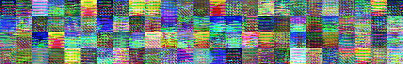


```python
nc = 3
nz = 100
ngf = 64
ndf = 64
n_extra_layers = 0
Diters = 5
λ = 10

imageSize = 32
batchSize = 10
lrD = 1e-4
lrG = 1e-4
```


```python
netG = DCGAN_G(imageSize, nz, ngf, nc, n_extra_layers)
netG.summary()
```

    _________________________________________________________________
    Layer (type)                 Output Shape              Param #   
    =================================================================
    input_27 (InputLayer)        (None, 100)               0         
    _________________________________________________________________
    reshape_8 (Reshape)          (None, 100, 1, 1)         0         
    _________________________________________________________________
    initial.100-256.convt (Conv2 (None, 256, 4, 4)         409600    
    _________________________________________________________________
    initial.256.batchnorm (Batch (None, 256, 4, 4)         1024      
    _________________________________________________________________
    initial.256.relu (Activation (None, 256, 4, 4)         0         
    _________________________________________________________________
    pyramid.256-128.convt (Conv2 (None, 128, 8, 8)         524288    
    _________________________________________________________________
    pyramid.128.batchnorm (Batch (None, 128, 8, 8)         512       
    _________________________________________________________________
    pyramid.128.relu (Activation (None, 128, 8, 8)         0         
    _________________________________________________________________
    pyramid.128-64.convt (Conv2D (None, 64, 16, 16)        131072    
    _________________________________________________________________
    pyramid.64.batchnorm (BatchN (None, 64, 16, 16)        256       
    _________________________________________________________________
    pyramid.64.relu (Activation) (None, 64, 16, 16)        0         
    _________________________________________________________________
    final.64-3.convt (Conv2DTran (None, 3, 32, 32)         3072      
    _________________________________________________________________
    final.3.tanh (Activation)    (None, 3, 32, 32)         0         
    =================================================================
    Total params: 1,069,824
    Trainable params: 1,068,928
    Non-trainable params: 896
    _________________________________________________________________
    


```python
netD = DCGAN_D(imageSize, nz,  ndf,nc, n_extra_layers)
netD.summary()
```

    _________________________________________________________________
    Layer (type)                 Output Shape              Param #   
    =================================================================
    input_28 (InputLayer)        (None, 3, 32, 32)         0         
    _________________________________________________________________
    initial.conv.3-64 (Conv2D)   (None, 64, 16, 16)        3072      
    _________________________________________________________________
    initial.relu.64 (LeakyReLU)  (None, 64, 16, 16)        0         
    _________________________________________________________________
    pyramid.64-128.conv (Conv2D) (None, 128, 8, 8)         131072    
    _________________________________________________________________
    pyramid.128.relu (LeakyReLU) (None, 128, 8, 8)         0         
    _________________________________________________________________
    pyramid.128-256.conv (Conv2D (None, 256, 4, 4)         524288    
    _________________________________________________________________
    pyramid.256.relu (LeakyReLU) (None, 256, 4, 4)         0         
    _________________________________________________________________
    final.256-1.conv (Conv2D)    (None, 1, 1, 1)           4096      
    _________________________________________________________________
    flatten_8 (Flatten)          (None, 1)                 0         
    =================================================================
    Total params: 662,528
    Trainable params: 662,528
    Non-trainable params: 0
    _________________________________________________________________
    


```python
from keras.optimizers import RMSprop, SGD, Adam
```


```python
netD_real_input = Input(shape=(nc, imageSize, imageSize))
noisev = Input(shape=(nz,))
netD_fake_input = netG(noisev)

ϵ_input = K.placeholder(shape=(None,1,1,1))
netD_mixed_input = Input(shape=(nc, imageSize, imageSize),
    tensor=ϵ_input * netD_real_input + (1-ϵ_input) * netD_fake_input)


loss_real = K.mean(netD(netD_real_input))
loss_fake = K.mean(netD(netD_fake_input))

grad_mixed = K.gradients(netD(netD_mixed_input), [netD_mixed_input])[0]
norm_grad_mixed = K.sqrt(K.sum(K.square(grad_mixed), axis=[1,2,3]))
grad_penalty = K.mean(K.square(norm_grad_mixed -1))

loss = loss_fake - loss_real + λ * grad_penalty


training_updates = Adam(lr=lrD, beta_1=0.0, beta_2=0.9).get_updates(netD.trainable_weights,[],loss)

netD_train = K.function([netD_real_input, noisev, ϵ_input],
                        [loss_real, loss_fake],    
                        training_updates)
```


```python
loss = -loss_fake 
training_updates = Adam(lr=lrG, beta_1=0.0, beta_2=0.9).get_updates(netG.trainable_weights,[], loss)
netG_train = K.function([noisev], [loss], training_updates)
```


```python
fixed_noise = np.random.normal(size=(batchSize, nz)).astype('float32')
```


```python
processed_images.shape
```


    (1732, 32, 32, 3)


```python
train_X.shape
```


    (1732, 32, 32, 3)


```python
train_X = processed_images
```


```python
#train_X[2]
```


```python
import sys
import time
t0 = time.time()
niter = 100
gen_iterations = 0
errG = 0
targetD = np.float32([2]*batchSize+[-2]*batchSize)[:, None]
targetG = np.ones(batchSize, dtype=np.float32)[:, None]
for epoch in range(niter):
    i = 0
    np.random.shuffle(train_X)
    batches = train_X.shape[0]//batchSize
    while i < batches:
        if gen_iterations < 25 or gen_iterations % 30 == 0:
            _Diters = 100
        else:
            _Diters = Diters
        j = 0
        while j < _Diters and i < batches:
            j+=1
            real_data = train_X[i*batchSize:(i+1)*batchSize]
            i+=1
            noise = np.random.normal(size=(batchSize, nz))        
            ϵ = np.random.uniform(size=(batchSize, 1, 1 ,1))
            real_data = real_data.reshape(10,3,32,32)
            errD_real, errD_fake  = netD_train([real_data, noise, ϵ])
            errD = errD_real - errD_fake
        
        if gen_iterations%20==0:
            print('[%d/%d][%d/%d][%d]  Loss_G: %f Use Time: %.2fs'
            % (epoch, niter, i, batches, gen_iterations, errG,time.time()-t0))
            fake = netG.predict(fixed_noise)
            showX(fake,4)
        noise = np.random.normal(size=(batchSize, nz))       
        errG, = netG_train([noise])
        gen_iterations+=1 
```

    [0/100][100/173][0]  Loss_G: 0.000000 Use Time: 9.07s
    


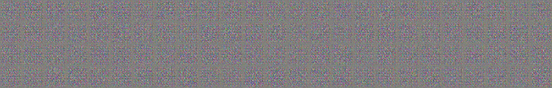


    [10/100][100/173][20]  Loss_G: -9.538339 Use Time: 165.01s
    


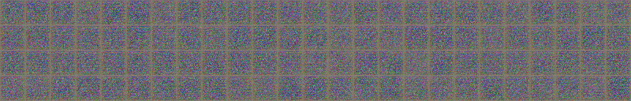


    [13/100][50/173][40]  Loss_G: -8.200562 Use Time: 207.32s
    


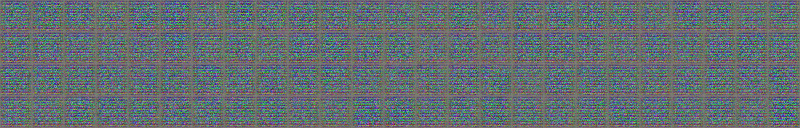


    [13/100][173/173][60]  Loss_G: -8.780455 Use Time: 219.35s
    


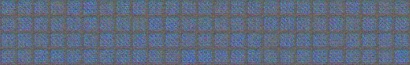


    [14/100][100/173][80]  Loss_G: -9.623591 Use Time: 229.50s
    


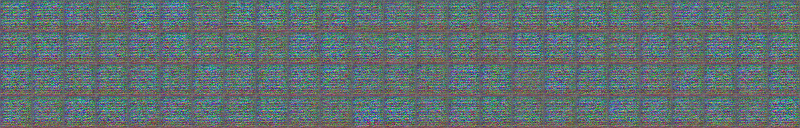


    [15/100][50/173][100]  Loss_G: -9.901346 Use Time: 241.52s
    


    [15/100][173/173][120]  Loss_G: -11.405231 Use Time: 253.67s
    


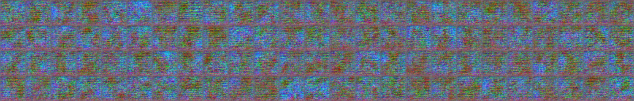


    [16/100][100/173][140]  Loss_G: -15.144888 Use Time: 263.75s
    


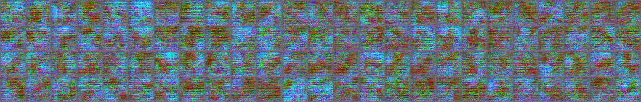


    [17/100][50/173][160]  Loss_G: -12.786685 Use Time: 275.83s
    


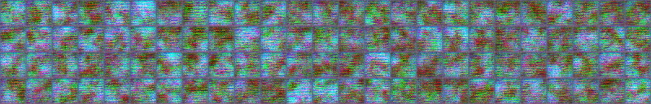


    [17/100][173/173][180]  Loss_G: -14.668077 Use Time: 287.79s
    


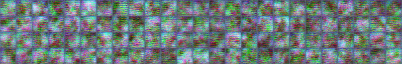


    [18/100][100/173][200]  Loss_G: -17.711411 Use Time: 297.79s
    


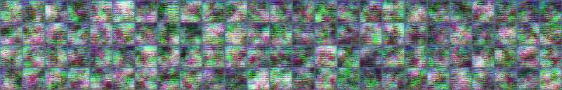


    [19/100][50/173][220]  Loss_G: -15.786426 Use Time: 309.80s
    


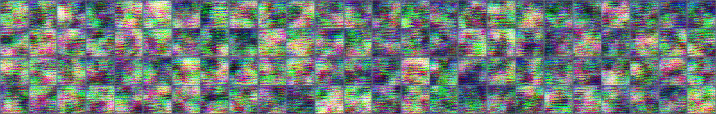


    [19/100][173/173][240]  Loss_G: -19.632151 Use Time: 321.84s
    


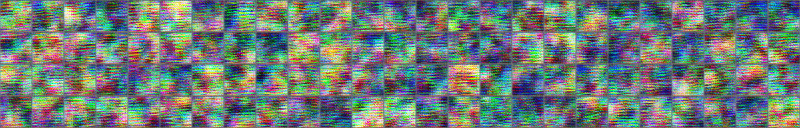


    [20/100][100/173][260]  Loss_G: -15.246013 Use Time: 331.88s
    


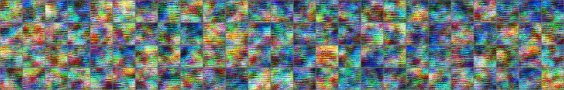


    [21/100][50/173][280]  Loss_G: -15.976041 Use Time: 343.88s
    


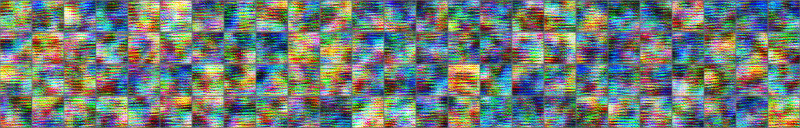


    [21/100][173/173][300]  Loss_G: -16.880358 Use Time: 355.85s
    


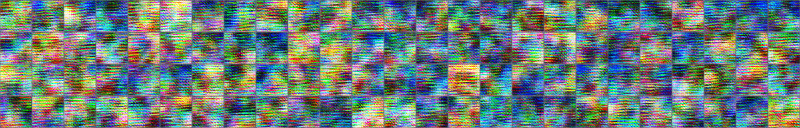


    [22/100][100/173][320]  Loss_G: -12.991282 Use Time: 365.83s
    


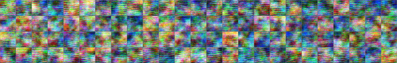


    [23/100][50/173][340]  Loss_G: -11.532784 Use Time: 377.93s
    


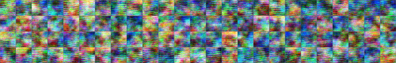


    [23/100][173/173][360]  Loss_G: -14.299355 Use Time: 389.95s
    


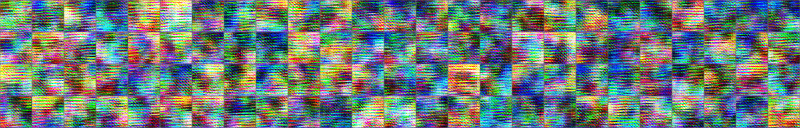


    [24/100][100/173][380]  Loss_G: -12.106143 Use Time: 400.01s
    


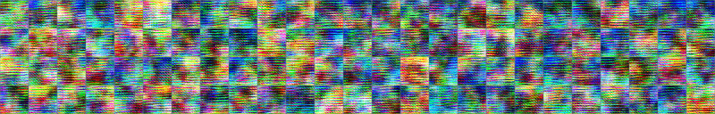


    [25/100][50/173][400]  Loss_G: -8.186361 Use Time: 412.06s
    


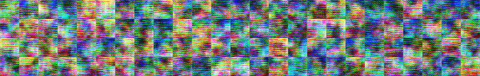


    [25/100][173/173][420]  Loss_G: -4.124841 Use Time: 424.05s
    


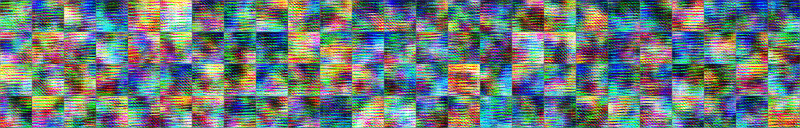


    [26/100][100/173][440]  Loss_G: -8.548252 Use Time: 434.11s
    


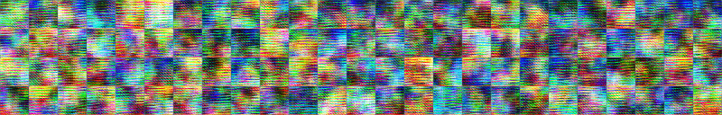


    [27/100][50/173][460]  Loss_G: -9.025020 Use Time: 446.12s
    


    [27/100][173/173][480]  Loss_G: -3.638637 Use Time: 458.13s
    


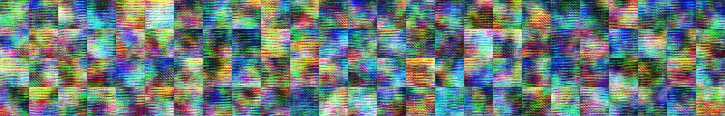


    [28/100][100/173][500]  Loss_G: -1.052333 Use Time: 468.15s
    


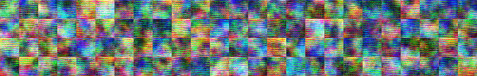


    [29/100][50/173][520]  Loss_G: 0.334226 Use Time: 480.15s
    


    [29/100][173/173][540]  Loss_G: -3.313530 Use Time: 492.19s
    


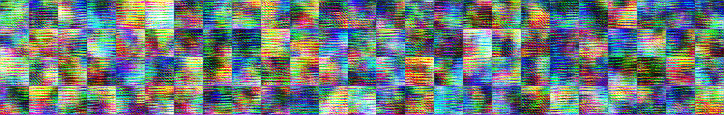


    [30/100][100/173][560]  Loss_G: -1.178925 Use Time: 502.29s
    


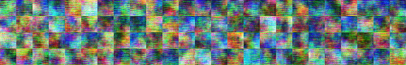


    [31/100][50/173][580]  Loss_G: -5.184628 Use Time: 514.39s
    


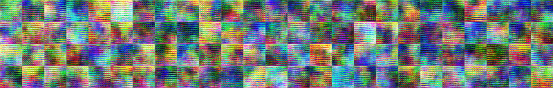


    [31/100][173/173][600]  Loss_G: -8.245576 Use Time: 526.40s
    


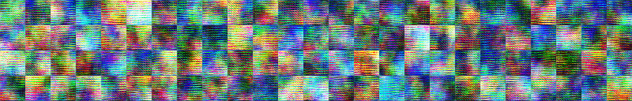


    [32/100][100/173][620]  Loss_G: -4.010512 Use Time: 536.47s
    


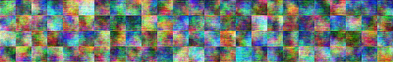


    [33/100][50/173][640]  Loss_G: -0.464324 Use Time: 548.48s
    


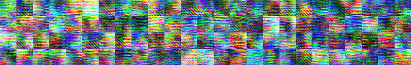


    [33/100][173/173][660]  Loss_G: -4.895674 Use Time: 560.46s
    


    [34/100][100/173][680]  Loss_G: -9.888752 Use Time: 570.50s
    


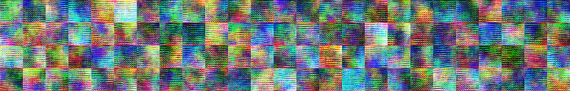


    [35/100][50/173][700]  Loss_G: -6.278117 Use Time: 582.52s
    


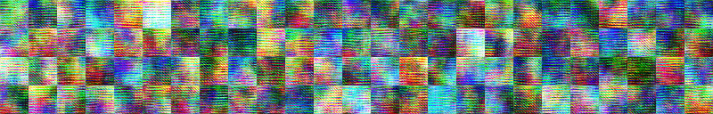


    [35/100][173/173][720]  Loss_G: -5.641103 Use Time: 594.47s
    


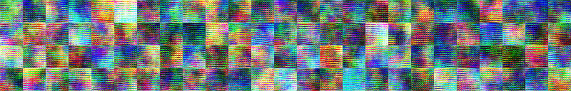


    [36/100][100/173][740]  Loss_G: 1.103494 Use Time: 604.34s
    


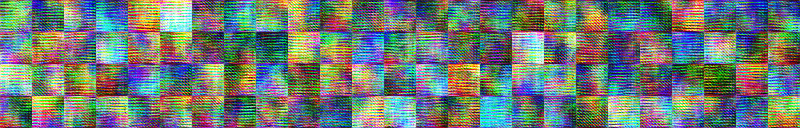


    [37/100][50/173][760]  Loss_G: -2.854865 Use Time: 616.23s
    


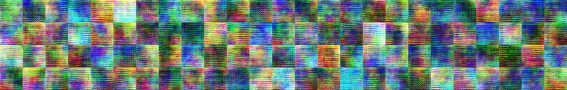


    [37/100][173/173][780]  Loss_G: 2.047048 Use Time: 628.00s
    


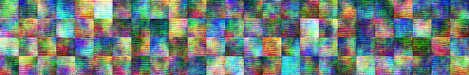


    [38/100][100/173][800]  Loss_G: -0.536859 Use Time: 637.79s
    


    [39/100][50/173][820]  Loss_G: -5.868684 Use Time: 649.95s
    


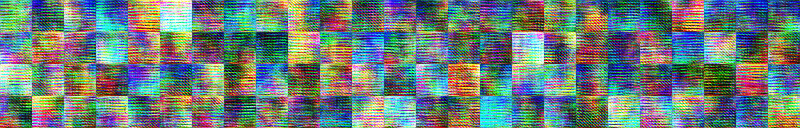


    [39/100][173/173][840]  Loss_G: -0.144758 Use Time: 662.05s
    


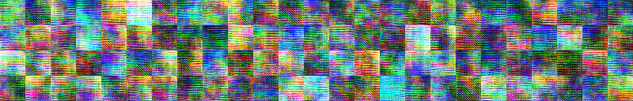


    [40/100][100/173][860]  Loss_G: -1.002761 Use Time: 672.07s
    


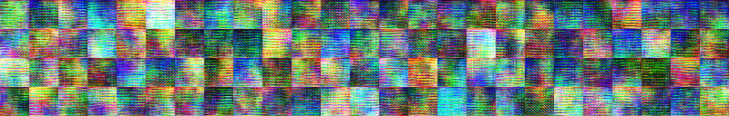


    [41/100][50/173][880]  Loss_G: -3.288972 Use Time: 684.82s
    


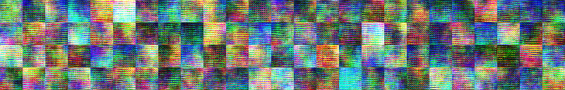


    [41/100][173/173][900]  Loss_G: -8.314287 Use Time: 697.24s
    


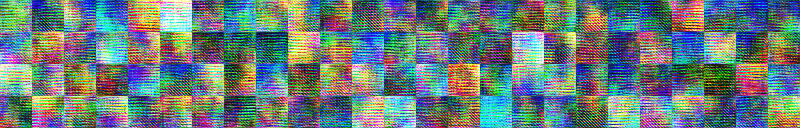


    [42/100][100/173][920]  Loss_G: 0.141136 Use Time: 707.45s
    


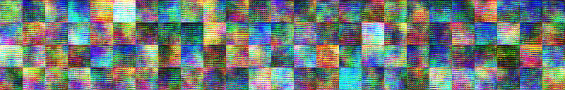


    [43/100][50/173][940]  Loss_G: -6.170231 Use Time: 719.78s
    


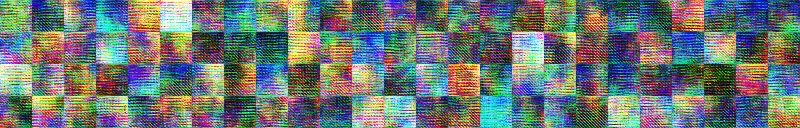


    [43/100][173/173][960]  Loss_G: 0.972157 Use Time: 732.36s
    


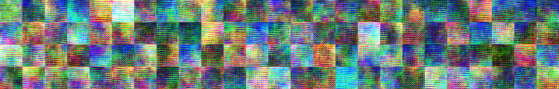


    [44/100][100/173][980]  Loss_G: -4.212987 Use Time: 742.98s
    


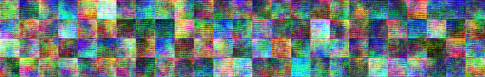


    [45/100][50/173][1000]  Loss_G: 0.742345 Use Time: 755.24s
    


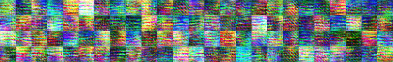


    [45/100][173/173][1020]  Loss_G: -1.854100 Use Time: 767.43s
    


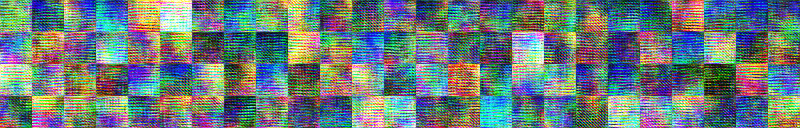


    [46/100][100/173][1040]  Loss_G: -6.121989 Use Time: 777.66s
    


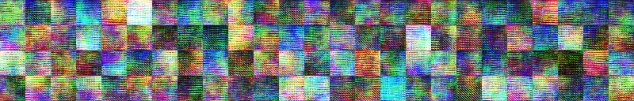


    [47/100][50/173][1060]  Loss_G: 0.312727 Use Time: 789.88s
    


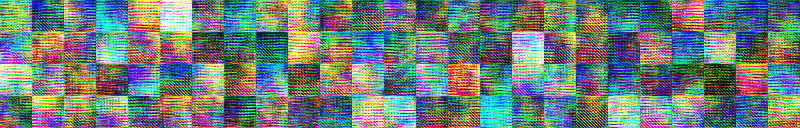


    [47/100][173/173][1080]  Loss_G: -5.075755 Use Time: 802.05s
    


    [48/100][100/173][1100]  Loss_G: -0.158791 Use Time: 812.20s
    


    [49/100][50/173][1120]  Loss_G: -5.665220 Use Time: 824.41s
    


    [49/100][173/173][1140]  Loss_G: -1.660948 Use Time: 836.44s
    


    [50/100][100/173][1160]  Loss_G: 0.129719 Use Time: 846.45s
    


    [51/100][50/173][1180]  Loss_G: 0.839641 Use Time: 858.76s
    


    [51/100][173/173][1200]  Loss_G: -0.098052 Use Time: 870.81s
    


    [52/100][100/173][1220]  Loss_G: 1.266267 Use Time: 880.86s
    


    [53/100][50/173][1240]  Loss_G: -6.018162 Use Time: 892.89s
    


    [53/100][173/173][1260]  Loss_G: -1.514387 Use Time: 904.92s
    


    [54/100][100/173][1280]  Loss_G: -2.746803 Use Time: 914.94s
    


    [55/100][50/173][1300]  Loss_G: -2.586313 Use Time: 927.06s
    


    [55/100][173/173][1320]  Loss_G: -3.482279 Use Time: 939.11s
    


    [56/100][100/173][1340]  Loss_G: 4.415460 Use Time: 949.12s
    


    [57/100][50/173][1360]  Loss_G: 2.227641 Use Time: 961.22s
    


    [57/100][173/173][1380]  Loss_G: -4.874788 Use Time: 973.46s
    


    [58/100][100/173][1400]  Loss_G: -0.596613 Use Time: 983.69s
    


    [59/100][50/173][1420]  Loss_G: -1.549839 Use Time: 995.62s
    


    [59/100][173/173][1440]  Loss_G: 0.659573 Use Time: 1007.63s
    


    [60/100][100/173][1460]  Loss_G: -0.069228 Use Time: 1017.68s
    


    [61/100][50/173][1480]  Loss_G: -3.375694 Use Time: 1029.70s
    


    [61/100][173/173][1500]  Loss_G: 2.448021 Use Time: 1041.68s
    


    [62/100][100/173][1520]  Loss_G: 0.051703 Use Time: 1051.67s
    


    [63/100][50/173][1540]  Loss_G: -0.305700 Use Time: 1063.70s
    


    [63/100][173/173][1560]  Loss_G: 0.956210 Use Time: 1075.71s
    


    [64/100][100/173][1580]  Loss_G: 0.971223 Use Time: 1085.73s
    


    [65/100][50/173][1600]  Loss_G: 1.790554 Use Time: 1098.03s
    


    [65/100][173/173][1620]  Loss_G: 4.194438 Use Time: 1110.08s
    


    [66/100][100/173][1640]  Loss_G: 0.334515 Use Time: 1120.09s
    


    [67/100][50/173][1660]  Loss_G: -0.307230 Use Time: 1132.17s
    


    [67/100][173/173][1680]  Loss_G: 0.221488 Use Time: 1144.19s
    


    [68/100][100/173][1700]  Loss_G: 2.380311 Use Time: 1154.19s
    


    [69/100][50/173][1720]  Loss_G: -0.798999 Use Time: 1166.25s
    


    [69/100][173/173][1740]  Loss_G: -1.563985 Use Time: 1178.23s
    


    [70/100][100/173][1760]  Loss_G: 0.769093 Use Time: 1188.24s
    


    [71/100][50/173][1780]  Loss_G: 0.476231 Use Time: 1200.07s
    


    [71/100][173/173][1800]  Loss_G: -0.986424 Use Time: 1211.91s
    


    [72/100][100/173][1820]  Loss_G: -1.420884 Use Time: 1221.97s
    


    [73/100][50/173][1840]  Loss_G: 0.797318 Use Time: 1233.75s
    


    [73/100][173/173][1860]  Loss_G: 3.730904 Use Time: 1245.78s
    


    [74/100][100/173][1880]  Loss_G: 0.046273 Use Time: 1255.81s
    


    [75/100][50/173][1900]  Loss_G: 0.824169 Use Time: 1267.91s
    


    [75/100][173/173][1920]  Loss_G: -2.292961 Use Time: 1279.90s
    


    [76/100][100/173][1940]  Loss_G: 0.563681 Use Time: 1289.89s
    


    [77/100][50/173][1960]  Loss_G: -3.805971 Use Time: 1301.86s
    


    [77/100][173/173][1980]  Loss_G: -2.459733 Use Time: 1313.77s
    


    [78/100][100/173][2000]  Loss_G: -3.887344 Use Time: 1323.76s
    


    [79/100][50/173][2020]  Loss_G: -1.445673 Use Time: 1336.40s
    


    [79/100][173/173][2040]  Loss_G: -3.828898 Use Time: 1349.23s
    


    [80/100][100/173][2060]  Loss_G: 1.044299 Use Time: 1359.32s
    


    [81/100][50/173][2080]  Loss_G: -0.115981 Use Time: 1371.48s
    


    [81/100][173/173][2100]  Loss_G: -3.331006 Use Time: 1383.78s
    


    [82/100][100/173][2120]  Loss_G: -0.354470 Use Time: 1393.98s
    


    [83/100][50/173][2140]  Loss_G: 2.837942 Use Time: 1406.16s
    


    [83/100][173/173][2160]  Loss_G: 1.812452 Use Time: 1418.14s
    


    [84/100][100/173][2180]  Loss_G: -0.412533 Use Time: 1428.14s
    


    [85/100][50/173][2200]  Loss_G: -1.714195 Use Time: 1440.19s
    


    [85/100][173/173][2220]  Loss_G: 1.585540 Use Time: 1452.15s
    


    [86/100][100/173][2240]  Loss_G: -3.342026 Use Time: 1462.15s
    


    [87/100][50/173][2260]  Loss_G: -2.659637 Use Time: 1474.65s
    


    [87/100][173/173][2280]  Loss_G: -1.820581 Use Time: 1487.22s
    


    [88/100][100/173][2300]  Loss_G: -0.536645 Use Time: 1497.57s
    


    [89/100][50/173][2320]  Loss_G: -0.065226 Use Time: 1510.13s
    


    [89/100][173/173][2340]  Loss_G: -0.293342 Use Time: 1522.40s
    


    [90/100][100/173][2360]  Loss_G: -0.343204 Use Time: 1532.64s
    


    [91/100][50/173][2380]  Loss_G: -0.394823 Use Time: 1544.95s
    


    [91/100][173/173][2400]  Loss_G: 1.254918 Use Time: 1557.27s
    


    [92/100][100/173][2420]  Loss_G: 3.076496 Use Time: 1567.49s
    


    [93/100][50/173][2440]  Loss_G: -0.587209 Use Time: 1579.78s
    


    [93/100][173/173][2460]  Loss_G: -0.394476 Use Time: 1592.16s
    


    [94/100][100/173][2480]  Loss_G: -2.610414 Use Time: 1602.43s
    


    [95/100][50/173][2500]  Loss_G: -0.548584 Use Time: 1614.72s
    


    [95/100][173/173][2520]  Loss_G: -0.811097 Use Time: 1626.98s
    


    [96/100][100/173][2540]  Loss_G: -1.407941 Use Time: 1637.26s
    


    [97/100][50/173][2560]  Loss_G: -0.810115 Use Time: 1649.49s
    


    [97/100][173/173][2580]  Loss_G: 1.327765 Use Time: 1661.58s
    


    [98/100][100/173][2600]  Loss_G: -0.814622 Use Time: 1671.72s
    


    [99/100][50/173][2620]  Loss_G: 1.467116 Use Time: 1684.01s
    


    [99/100][173/173][2640]  Loss_G: -1.293410 Use Time: 1696.19s
    


```python
train_X[:1].shape == fake.shape
```


    True


```python
showX(fake,5)
```


```python
fake.shape
```


    (100, 3, 32, 32)


